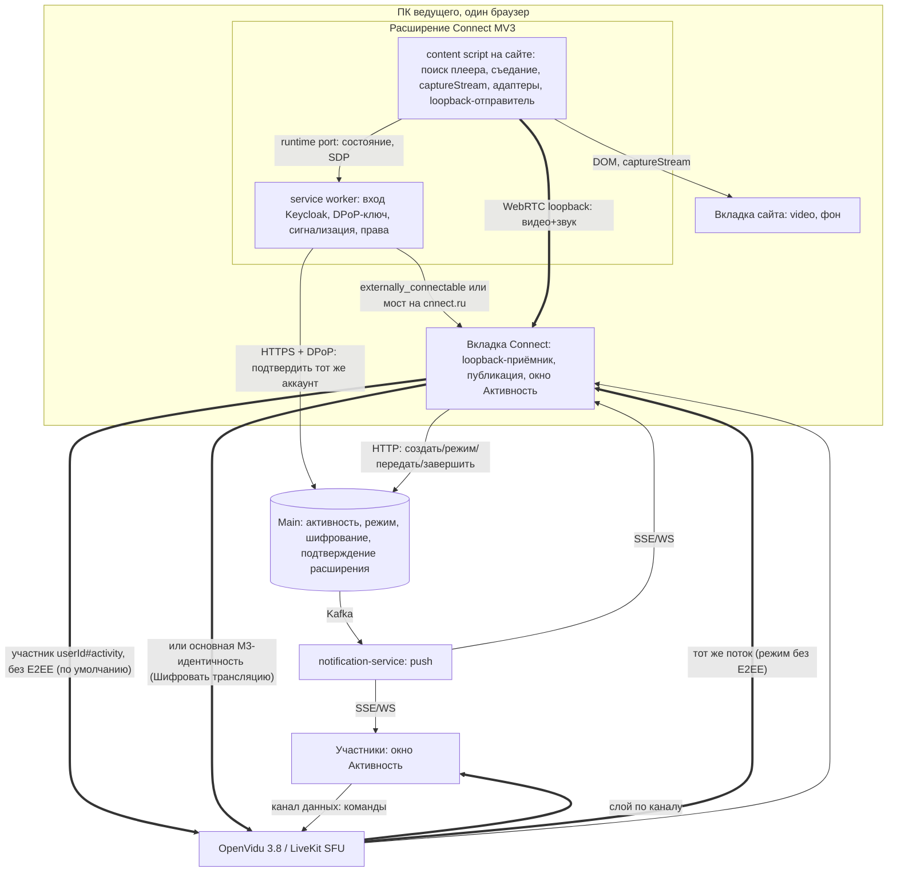
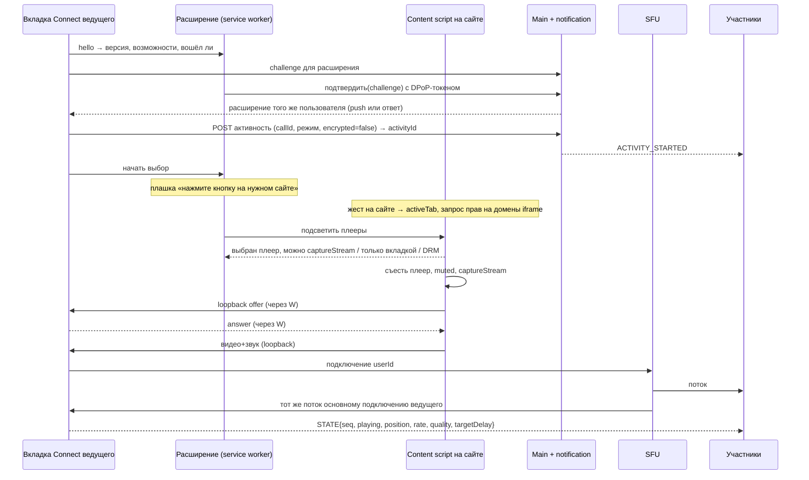

# Совместная активность Connect: анализ постановки activity-share

Редакция 2 от 6 октября 2026 (первая редакция — коммит `2541ed5` в этой ветке). Предмет: файл [`activity-share`](activity-share) — «Shared Activity — совместный просмотр через browser extension». В постановке приложение названо «Svyaz»; это Connect (cnnect.ru).

## Что изменилось во второй редакции

Первая редакция предлагала отдавать вкладку сайта в Connect через демонстрацию экрана, а расширению оставить только выбор плеера и команды. Пользователь выбрал другую модель, и анализ переписан под неё:

1. **Расширение «съедает» плеер.** На сайте плеер становится чёрным прямоугольником и не звучит, но продолжает играть под управлением расширения; видео и звук уходят в окно «Активность» Connect. Демонстрацию экрана пользователь не запускает.
2. **Поток плеера передаётся во вкладку Connect**, а дальше работает существующий механизм Connect: публикация трека в звонок, переключатель шифрования, права, окно активности. Вариант «расширение — отдельный участник звонка» остаётся запасным.
3. **По умолчанию трансляция без сквозного шифрования**: главное — скорость, минимальная задержка, минимум потерь и лучшее качество. Транспортное шифрование DTLS-SRTP остаётся всегда. У ведущего есть переключатель «Шифровать трансляцию» (M3, как у звонков) для приватного контента, в том числе 18+. На активности у всех видна метка «Защищено» или «Без шифрования». Активность разрешена только в приватных звонках.
4. **В расширении выполняется вход своим аккаунтом Connect**, и Connect проверяет, что расширение установлено и в нём вход тем же аккаунтом.
5. DRM-кинотеатры пользователю не важны. Они не будут работать (см. §3.6), и дальше анализ на них не останавливается.

## Главное за минуту

1. **Модель пользователя реализуема в ПК-браузерах Chromium** (Chrome, Edge, Яндекс Браузер, Opera) **для YouTube, VK Видео, Rutube, Twitch и сайтов с HLS-плеерами**, в том числе когда плеер лежит в iframe чужого домена (типично для сайтов с аниме). Это проверено прототипом на repos 6 октября (§2): `HTMLMediaElement.captureStream()` из content script отдаёт видео до 1080p60 (VK — до 2160p) и звук, когда плеер **скрыт** (opacity 0, чёрная накладка, `visibility:hidden`, вынесен за экран, даже `display:none`), **заглушён** (`muted`, `volume=0` — звук в захвате остаётся) и когда вкладка сайта **в фоне** (`visibilityState=hidden`, 60 к/с без просадки).
2. **Главный технический риск — cross-origin без CORS.** Если сайт отдаёт видео обычным `<video src>` с чужого домена без CORS, Chrome бросает `SecurityError: Cannot capture from element with cross-origin data`, а Firefox отдаёт изолированный трек без звука. Для таких сайтов в Chromium есть запасной путь — захват вкладки `chrome.tabCapture` (плеер тогда не «съедается», а растягивается на всю фоновую вкладку). В Firefox запасного пути нет. Плееры на MSE/HLS (`blob:`), то есть YouTube, VK, Rutube, Twitch и hls.js, этого ограничения не имеют.
3. **Передача потока во вкладку Connect** в Chromium и Firefox делается локальным WebRTC-соединением (loopback) между content script вкладки сайта и вкладкой Connect, сигнализация идёт через расширение. Прототип: 1080p60 (HLS), 1440p25 (VK), 720p30 (YouTube embed, Twitch) приходят во вкладку-приёмник при фоновой вкладке сайта. Цена — лишнее кодирование и декодирование на ПК ведущего (≈ 40–70 мс и 0,5–1 ядро) и разгон полосы на loopback 10–25 с, который нужно убрать настройками (§4.4).
4. **Ведущий смотрит тот же поток с сервера, что и все.** В режиме без шифрования вкладка Connect публикует активность отдельным подключением-участником `<userId>#activity`, а основное подключение ведущего подписывается на него через SFU, как все. Отдельное подключение нужно в любом случае: в connect-ui E2EE включается на всю комнату (`new Room({ e2ee })`), и один незашифрованный трек в защищённом подключении не опубликовать. В режиме «Шифровать трансляцию» публикует основная M3-идентичность (путь демонстрации экрана), а ведущий смотрит свой поток с локальной задержкой D.
5. **Вход в расширении** — Keycloak Connect, Authorization Code + PKCE, DPoP-привязка токенов: `chrome.identity.launchWebAuthFlow` (Chrome, Edge, Opera), `browser.identity.launchWebAuthFlow` (Firefox ПК). Связь с Connect: `externally_connectable` (Chromium, Safari) или мост через content script на cnnect.ru (Firefox). «Тот же аккаунт» подтверждает сервер (Main) по одноразовому вызову (challenge), а не слово расширения (§5).
6. **Магазины.** Chrome Web Store ($5 один раз; Яндекс Браузер и Opera ставят расширения из CWS), Edge Add-ons (бесплатно, проверка до 7 рабочих дней), Firefox AMO (бесплатно, подпись обязательна), Opera add-ons (бесплатно). Риск отказа общий: политики CWS и Edge дословно запрещают расширения, которые «облегчают несанкционированную трансляцию защищённого авторским правом контента». Safari (macOS/iOS) — только внутри приложения за $99 в год, а главное — в Safari нет `captureStream()`. На телефонах ведущим быть нельзя: в Chrome и Samsung Internet для Android сторонних расширений нет, в Edge для Android — бета с отобранным списком.
7. **Нативное ПК-приложение Connect (Electron)** — сильный план Б и дополнение: сайт открывается во встроенном Chromium в скрытом окне, захват идёт целиком из этого окна (`setDisplayMediaRequestHandler` с `WebFrameMain`), поэтому **ограничение cross-origin пропадает**, магазин не нужен, а «съеденный» плеер получается естественно. Цена: установка приложения, сайты могут отказывать встроенному браузеру во входе (Google), сопровождение сборки.
8. **Рекомендация.** MVP — расширение для Chromium-ПК (CWS + Edge Add-ons) с захватом `captureStream()` → loopback → вкладка Connect → отдельный участник без E2EE. Шифрование — следующим этапом. Firefox — после MVP. Electron — параллельной веткой, если CWS откажет или если cross-origin-сайты окажутся важными. Первым делом — этап 0: прототип на настоящем звонке Connect (OpenVidu) с замером задержки и разброса (§12).

## 1. Сценарий пользователя

1. В звонке Connect: «Активность» → «Просмотр видео с сайта».
2. Connect проверяет расширение: оно установлено, в нём выполнен вход, и это **тот же аккаунт**. Если нет — на месте объясняет, что сделать: «Установить расширение» (ссылка на магазин своего браузера), «Войти в расширении», «В расширении другой аккаунт — выйти и войти как @login». Ошибки показываются на месте с кнопкой «Повторить», без блокирующих экранов.
3. Connect передаёт расширению команду «начать выбор». Расширение показывает плашку (бейдж на значке, всплывающее окно или уведомление): «Перейдите на сайт с видео и нажмите кнопку выбора плеера».
4. Пользователь переходит на сайт и нажимает кнопку расширения (значок на панели, пункт контекстного меню или горячую клавишу). Это пользовательский жест: он нужен для `activeTab` и `tabCapture`. Расширение подсвечивает рамкой **все плееры, которые можно транслировать**, у каждого — пометка «Можно» / «Только целиком вкладкой» (cross-origin) / «Защищено» (DRM).
5. Пользователь кликает плеер. Расширение «съедает» его: на месте плеера чёрный прямоугольник с надписью «Транслируется в Connect» и кнопкой «Вернуть плеер». Сайт не звучит, плеер играет под управлением расширения. Видео и звук уходят во вкладку Connect, у всех участников, **включая ведущего**, открывается окно «Активность».
6. В окне «Активность»: play/pause, перемотка, ±10 с, скорость, выбор качества (если сайт даёт), «Пропустить рекламу» (если сайт сейчас показывает свою кнопку), следующее/предыдущее. Нажатие от участника с правом выполняется у ведущего, эффект видят все. Видно, кто нажал.
7. У создателя активности настройки: «Управляю только я» / «Все участники» / «Только модераторы» (позже — по командам), «Шифровать трансляцию» (по умолчанию выключено), «Передать ведущего».
8. Завершение: «Завершить активность» у ведущего или модератора, закрытие вкладки сайта, «Вернуть плеер» на сайте, уход ведущего из звонка.

## 2. Прототип: что проверено руками

Код и сырые результаты: [`activity-share-prototype/`](activity-share-prototype/) (расширение MV3, тестовый сервер, оркестратор, планы прогонов, журналы). Запуск: `./real.sh plan-all.json` (обычный Chromium с расширением в окне на X-дисплее, без Playwright) и `node run.js firefox …` / `node ff-check.js` (Firefox 156 через Playwright).

**Методика.** Расширение (content script в isolated world, `all_frames`, поиск `<video>` в том числе в shadow DOM через `chrome.dom.openOrClosedShadowRoot`) находит плеер, запускает его и вызывает `captureStream()`. Затем по очереди применяет способы скрытия и глушения и меряет захват: кадры в секунду и размер — через `MediaStreamTrackProcessor`, «не чёрный ли кадр» — по средней яркости уменьшенного кадра, звук — RMS через `AnalyserNode`. Потом расширение открывает в том же окне вкладку-приёмник (заменяет вкладку Connect), сайт уходит в фон, и замер повторяется. Последний шаг — loopback: `RTCPeerConnection` из content script вкладки сайта во вкладку-приёмник, через 10 и 25 с снимается `getStats`.

**Грабли методики.** Playwright держит все страницы в состоянии `visible` (даже свёрнутое окно и фоновую вкладку) и добавляет флаги `--disable-renderer-backgrounding` и подобные. Поэтому фон проверялся в обычном Chromium 147 (Chrome for Testing) без Playwright: оркестратор работает в service worker расширения, вкладки открываются через `chrome.tabs.create`, результаты уходят POST-запросами на локальный сервер. Прокси-выход для YouTube получает «Sign in to confirm you're not a bot» на странице просмотра, поэтому YouTube замерен через embed — это тот же плеер и тот же MSE-поток.

### Результаты Chromium 147, Linux, 6 октября 2026

| Источник | Как устроено видео | `captureStream()` | Скрыт (5 способов) + `muted`/`volume 0` | Вкладка сайта в фоне (`hidden`) | Loopback во вкладку-приёмник, 25 с |
|---|---|---|---|---|---|
| hls.js demo (mux test stream) | MSE `blob:`, верхний кадр | видео + звук | 60 к/с, 1920×1080, звук есть | 60,3 к/с, 1920×1080, звук есть | 1920×1080 @60, VP8 |
| Тот же HLS в **iframe чужого домена** (как сайты с аниме) | MSE `blob:` в iframe | видео + звук | 60 к/с, 1080p, звук есть | 60,3 к/с, 1080p | 1280×720 @57 (полоса ещё росла) |
| YouTube embed (iframe youtube.com) | MSE `blob:` | видео + звук | 30 к/с, звук есть | 30,3 к/с, 1280×720 | 1280×720 @30 |
| YouTube watch | MSE `blob:` | треки live | — | — | не замерено: прокси-выход получает проверку «не бот» |
| Rutube (страница видео) | MSE `blob:` | видео + звук | 25 к/с, звук есть | 25,3 к/с, 853×480 | 853×480 @25 |
| Rutube embed | — | — | — | — | ролик запрещён правообладателем для встраивания |
| VK Видео | MSE `blob:`, `crossorigin=anonymous`, **плеер в shadow DOM** | видео + звук | 25 к/с, звук есть | 25,3 к/с, до 3840×2160 | 2560×1440 @25 |
| Twitch (главная, живой эфир) | MSE | видео + звук | 30 к/с, звук есть | 30,3 к/с, 1280×720 | 1280×720 @30 |
| `<video src>` mp4 с чужого домена без CORS | прямой файл | **`SecurityError: Cannot capture from element with cross-origin data`** | — | — | — |
| Тот же mp4 с `crossorigin=anonymous`, сервер без CORS | — | видео не загружается вообще | — | — | — |

Дополнительно:

- Через 10 с loopback отдаёт 320×180…1280×720 (оценка полосы WebRTC разгоняется от низкого старта), через 25 с — полное разрешение, `qualityLimitationReason: none`. Это настраивается (§4.4).
- Звук в захвате есть при `muted=true` и `volume=0` — сайт молчит, поток звучит. В Chrome это совпадает со спецификацией [Media Capture from DOM Elements](https://w3c.github.io/mediacapture-fromelement/).
- Страница с CSP `connect-src 'self'`: WebSocket из **isolated world** content script открывается (CSP страницы его не ограничивает), из main world — блокируется. Значит, LiveKit-клиент внутри content script (запасной вариант «расширение — участник») не упрётся в CSP сайта. WebRTC под CSP не попадает вовсе.
- `externally_connectable`: страница `http://localhost` нашла расширение по ID и получила ответ `{ok, version, origin, tab}`.

### Результаты Firefox 156 (Playwright, без расширения, тот же код в main world)

| Проверка | Результат |
|---|---|
| `captureStream()` (без префикса с Firefox 149) на HLS в верхнем кадре и в iframe | видео + звук, 1080p; скрытие пятью способами, `muted`, `volume 0` — кадры и звук идут |
| mp4 с чужого домена без CORS | исключения нет, но трек **только видео, без звука**, кадры изолированы (`getImageData` → `SecurityError`) — для трансляции непригодно |
| Loopback `RTCPeerConnection` между вкладками | работает: 960×540 @60 через 20 с (headless, нужны host-кандидаты ICE) |
| Фон вкладки | не проверен: Playwright держит страницы видимыми; проверить на этапе 0 в обычном Firefox с временным расширением |

### Что прототип не проверял

Публикацию в настоящий звонок OpenVidu, задержку «глаз-в-глаз» и разброс между участниками, `tabCapture` (нужен настоящий жест пользователя), Edge/Яндекс/Opera отдельно (тот же Chromium — ожидается так же), Windows/macOS и аппаратные кодеки, CPU на типичном ноутбуке, рекламу внутри плеера YouTube. Всё это — этап 0 (§12).

## 3. Захват плеера по браузерам

### 3.1. `captureStream()` — основной путь

- **Где вызывать.** Content script в isolated world: элемент общий с страницей, поток живёт в контексте расширения, и страница не может подменить `captureStream`/`RTCPeerConnection`. Для iframe чужого домена — `all_frames: true` плюс host permission на домен iframe. Плееры в shadow DOM (VK) — через `chrome.dom.openOrClosedShadowRoot` (Chromium). В Firefox для закрытого shadow DOM есть `element.openOrClosedShadowRoot()` в content script.
- **Что захватывается.** Кадры декодера в исходном разрешении, независимо от размера и видимости элемента. Звук — до регулятора громкости элемента: локальная громкость и mute на захват не влияют.
- **MSE/blob** (YouTube, VK, Rutube, Twitch, hls.js, dash.js, большинство «аниме»-плееров): захват разрешён, если сегменты загружены через `fetch`/XHR с CORS. Это так у всех проверенных сайтов.
- **Cross-origin без CORS** (`<video src="https://cdn.other/…mp4">` без `crossorigin`): Chrome — исключение, Firefox — изолированный трек без звука. Подменить источник нельзя: перезагрузка с `crossorigin` ломает воспроизведение, если CDN не отдаёт CORS, — это и проверено. Для таких сайтов — запасной путь §3.3 (Chromium) или нативное приложение (§9).
- **Реклама внутри плеера.** Если реклама идёт в том же `<video>` (YouTube), она попадает в трансляцию — все увидят рекламу, которую видит ведущий. Если в отдельном `<video>` или iframe (IMA SDK), расширение видит смену элемента и предлагает переключиться. Адаптер YouTube знает признак `.ad-showing` и показывает в активности «Реклама на сайте» с кнопкой «Пропустить», когда сайт её показывает (§6).
- **Смена источника.** Следующая серия в том же элементе — поток продолжается. Если плеер пересоздаёт элемент, адаптер переподхватывает новый `<video>` (MutationObserver) и заменяет трек (`RTCRtpSender.replaceTrack` в loopback) без переподключения.

### 3.2. «Съесть» плеер

Достаточно поверх плеера поставить чёрную накладку с надписью и кнопкой «Вернуть плеер» и задать `opacity: 0` самому `<video>`, а сайт заглушить через `muted = true`. Все пять проверенных способов скрытия сохраняют 25–60 к/с захвата. Не нужно `display:none`: часть плееров по нему останавливается или переходит в «мини-плеер». Не нужно ставить на паузу или останавливать загрузку. Нужно перехватить клики по накладке, чтобы сайт не получил «клик по видео = пауза». Важно: некоторые сайты сами ставят видео на паузу при `visibilitychange` (фоновая вкладка) — это ловит адаптер, и в generic-режиме расширение отвечает `play()`, если пауза не пришла командой из активности.

### 3.3. `chrome.tabCapture` — запасной путь для Chromium

`chrome.tabCapture.getMediaStreamId({ targetTabId, consumerTabId })` после жеста на вкладке сайта, затем во вкладке Connect `getUserMedia({ video: { mandatory: { chromeMediaSource: "tab", chromeMediaSourceId } }, audio: … })`. Звук вкладки у ведущего локально перестаёт играть (так в документации). Захватывается **вся отрисованная вкладка**, поэтому плеер нельзя скрыть — его растягивают на всю вкладку («кинорежим»), а вкладка остаётся в фоне. Применять только для cross-origin-сайтов без CORS, в интерфейсе — пометка «Только целиком вкладкой». Кадрировать по плееру можно во вкладке Connect: `MediaStreamTrackProcessor` + `VideoFrame({ visibleRect })` + `MediaStreamTrackGenerator` (только Chromium). Element/Region Capture не подходит: работает только при захвате собственной вкладки.

### 3.4. Передача потока во вкладку Connect

`MediaStreamTrack` нельзя передать в другую вкладку: ни `postMessage`, ни `BroadcastChannel`, ни порт расширения его не переносят. Варианты:

| Путь | Chromium | Firefox | Safari | Оценка |
|---|---|---|---|---|
| **WebRTC loopback**: `RTCPeerConnection` в content script вкладки сайта ↔ вкладка Connect, SDP через расширение | да (проверено: до 1080p60 и 1440p25) | да (проверено, 540p60 в headless) | нет `captureStream()` | **Основной** |
| `tabCapture` streamId + `consumerTabId` | да (вся вкладка, плеер не скрыть) | нет API | нет | Запасной для cross-origin |
| Кадры через WebCodecs + порт расширения | теоретически | теоретически | — | Хуже loopback: сериализация, своя синхронизация звука |
| Расширение само публикует в звонок (участник LiveKit) | да (WebSocket из isolated world не ограничен CSP) | да | — | Запасной (§4.6) |

### 3.5. Firefox и Safari

- **Firefox ПК**: `captureStream()` с 149, loopback работает, `identity.launchWebAuthFlow` есть. Нет `tabCapture`, нет `externally_connectable`, `getDisplayMedia` не отдаёт звук вкладки — cross-origin-сайты без CORS в Firefox не транслируются никак. Можно сделать вторым после Chromium.
- **Firefox Android**: `captureStream()` есть, расширения публикуются на AMO, но `identity` нет, фоновые вкладки на телефоне останавливаются ОС, кодировать 1080p на телефоне и держать звонок — тяжело. Ведущим на Android не делать.
- **Safari (macOS, iOS)**: `HTMLMediaElement.captureStream()` не поддерживается ни в одной версии (MDN BCD). Обход «перерисовка `<video>` в `<canvas>` → `canvas.captureStream()` + звук через `createMediaElementSource`» не работает в фоновой вкладке (таймеры и `requestAnimationFrame` останавливаются), а для cross-origin даёт пустой canvas. Ведущий в Safari — нет. Зритель — да, как сейчас.

### 3.6. DRM коротко

Кинотеатры с Widevine/PlayReady (Кинопоиск, Okko, Иви, платные фильмы YouTube и т. п.): `captureStream()` для EME запрещён, захват вкладки даёт чёрный кадр. Расширение помечает такой плеер «Защищено» (`video.mediaKeys !== null`) и не даёт его выбрать. Обходить защиту не делаем.

## 4. Архитектура «расширение забирает плеер»

### 4.1. Ментальная модель

Есть один источник — `<video>` на сайте у ведущего. **Расширение** — руки и глаза на сайте: найти плеер, «съесть» его, снять видео и звук, передать поток во вкладку Connect, выполнять команды и сообщать состояние плеера. **Вкладка Connect** ведущего — всё про звонок: публикация трека в комнату (с шифрованием или без), права, состояние активности, окно «Активность». **SFU** раздаёт поток всем, включая самого ведущего. **Main** хранит, что активность идёт, кто ведущий, какой режим и шифруется ли трансляция.

### 4.2. Контейнеры (C4 Container)

| Контейнер | Отвечает за | Почему граница здесь |
|---|---|---|
| Расширение: content script | Поиск и подсветка плееров (включая iframe и shadow DOM), «съедание», `captureStream()`, адаптеры сайтов, выполнение команд, отчёт состояния, отправитель loopback | Только он видит DOM чужого сайта; isolated world защищает поток от скриптов сайта |
| Расширение: service worker | Вход (Keycloak, PKCE, DPoP), хранение токена, сигнализация loopback, запрос прав на домен, `tabCapture` | Единственное место с правами расширения и долгоживущим состоянием |
| Вкладка Connect | Приём loopback, публикация, переключатель шифрования, права, рассылка состояния, окно «Активность» у ведущего | Здесь уже есть авторизация, комната, M3, переподключение и проверки медиа |
| Main | Запись активности: `activityId`, `callId`, ведущий, режим управления, `encrypted`, ревизия; подтверждение расширения | Права и единственность ведущего решает сервер |
| SFU | Раздача слоёв, приоритеты, канал данных | Без изменений сервера |
| Зрители | Окно «Активность», общая задержка, громкость, приглушение под голос, команды | Обычные подписчики |

### 4.3. Критический сценарий: запуск и первая картинка

Синхронные границы: подтверждение расширения и создание активности в Main (идемпотентно по ключу клиента). Асинхронные: push участникам, публикация трека, первое состояние. Окно у участников открывается по push заранее (резерв места без «прыжков»), видео появляется по подписке на трек с атрибутом `activityId`.

### 4.4. Loopback: как сделать его незаметным

- Видео: `contentHint = "motion"`, `degradationPreference = "maintain-resolution"`, `maxBitrate` 20–30 Мбит/с, `maxFramerate` как у источника (до 60). Старт полосы — подсказки `x-google-start-bitrate`/`x-google-min-bitrate` в локальном SDP (Chromium), иначе первые 10–25 с идут в низком разрешении (прототип). Кодек loopback — H.264 с аппаратным кодированием, если есть, иначе VP8. Simulcast на loopback не нужен.
- Звук: Opus стерео 256 кбит/с, `useinbandfec=1`, без DTX и без обработки (AEC/NS/AGC не применяются к удалённому треку — это важно только на публикации).
- Задержка: loopback добавляет ≈ кодирование 5–25 мс + декодирование 5–15 мс + буфер 10–20 мс (по `jitterBufferDelay` в прототипе). Для всех зрителей одинаково, на разброс не влияет.
- Без лишнего второго кодирования можно обойтись только двумя способами: «расширение само публикует» (§4.6) или пересылка закодированных кадров (`RTCRtpScriptTransform`) без декодирования — это экспериментально и пока не рассматривается.

### 4.5. Публикация и шифрование: два режима

| | **Без шифрования (по умолчанию)** | **«Шифровать трансляцию»** |
|---|---|---|
| Кто публикует | Вкладка Connect, **второе подключение** `<userId>#activity`, только публикация, без E2EE (DTLS-SRTP остаётся) | Основное подключение ведущего с M3 — путь демонстрации экрана (`ScreenShare` + `ScreenShareAudio`, атрибут `activityId`) |
| Как смотрит ведущий | Подписывается на `#activity` через SFU, как все: **тот же путь и та же задержка** | Свой трек не подписать — локальная задержка D (очередь `VideoFrame`, `DelayNode`), ошибка ≈ ±50 мс; точно — после второй M3-идентичности (решение T45) |
| Кодеки | H.264 с аппаратным кодированием (simulcast 3 слоя) по умолчанию; VP9 SVC L3T3 как вариант без аппаратного H.264; AV1 — позже | Как сейчас в защищённых звонках: VP8 (H.264 для iPhone/iPad), backup codec недоступен |
| Потери | NACK/RTX (по умолчанию), RED для звука фильма, FlexFEC для видео — эксперимент | NACK/RTX; RED для звука экрана сейчас выключен в E2EE (`openvidu.ts`), включать по образцу `m3ClearRed` |
| Цена | +1 подключение у ведущего, поток вниз ведущему (+3–10 Мбит/с), токен от Main на вторую идентичность с правом только публиковать экран | VP8 программно 1080p60 — 1,5–2 ядра; нет SVC; разброс у ведущего хуже; задержка шифрования мала (≈ 1–3 мс на кадр) |
| Метка у всех | «Без шифрования» | «Защищено» |

Почему по умолчанию без шифрования: лучшее качество на тех же битах (аппаратный H.264/VP9 SVC), RED/FEC без особых путей, ведущий синхронен со всеми, проще расширение. Шифрование нужно тем, кто смотрит личное или 18+, — им понятна цена.

Защищённые звонки и участник без M3: клиенты Connect сейчас ждут, что в M3-комнате все участники допущены по M3 (`m3MediaRoster`, `m3CallMediaGuard`). Участник `#activity` нужно явно разрешить: атрибуты `kind=activity`, `owner=<userId>`, `encryption=none`; клиенты показывают его не плиткой участника, а окном «Активность» с меткой «Без шифрования». Токен на `#activity` выдаёт Main только ведущему активной активности, только с `canPublishSources=[screen_share, screen_share_audio]` и без подписок.

### 4.6. Запасной вариант: расширение — отдельный участник

Content script сам подключается к комнате как `<userId>#activity` (токен приходит из вкладки Connect через расширение) и публикует трек без loopback. Плюсы: нет второго кодирования (−40–70 мс и −0,5–1 ядро), вкладка Connect может быть закрыта. Минусы: LiveKit-клиент (~200 КБ) в content script на каждом сайте; токен звонка в контексте расширения; шифрование в этом варианте потребовало бы M3 в расширении (MLS-ядро WASM, допуск устройства) — поэтому только без шифрования. Применять, если этап 0 покажет, что loopback заметно ухудшает картинку или нагружает ПК ведущего.

### 4.7. Синхронность у всех, включая ведущего

1. Общая целевая задержка показа **D** (по умолчанию 300 мс без шифрования, 500 мс с шифрованием; диапазон 200–1500 мс) — в `STATE`.
2. Каждый зритель, включая основное подключение ведущего, ставит `RTCRtpReceiver.jitterBufferTarget` (есть в Chromium; поддержку в Firefox и Safari проверить на этапе 0, без неё — только адаптивный буфер и подгонка по отчётам) так, чтобы показ шёл через D после публикации: `jitterBufferTarget = max(0, D − оценка_пути)`, оценка из `getStats` (`roundTripTime`, `jitterBufferDelay/jitterBufferEmittedCount`, задержка кодирования из `STATE`).
3. Раз в 2–5 с зритель сообщает фактическую задержку; если кто-то не укладывается, ведущий поднимает D ступенями ≤ 100 мс (без рывков).
4. Видео и звук одного источника синхронизирует WebRTC (lip-sync), если они в одном `MediaStream` у публикатора — проверить для `#activity` в LiveKit.
5. Точнее, если понадобится: метки «RTP timestamp ↔ время сервера» раз в секунду по каналу данных и `requestVideoFrameCallback` у зрителя.

### 4.8. Управление: команды и состояние

- Команды: `PLAY`, `PAUSE`, `SEEK(t)`, `SEEK_REL(±10)`, `SET_RATE`, `SET_QUALITY(id)`, `NEXT`, `PREV`, `SKIP_AD`. Громкость и mute — локальные у каждого зрителя.
- Транспорт: канал данных LiveKit, `reliable`, тема `connect.activity.v1`, адресат — ведущий. В режиме «Шифровать» — через M3-шифрование данных звонка (`encryptDataRequest`), в режиме без шифрования — открытым текстом внутри DTLS (в сообщениях нет URL и названия сайта, только позиция и состояние).
- Формат: `{activityId, revision, cmdId, from, kind, args, baseSeq}`. Вкладка Connect ведущего проверяет режим и права (ревизия из Main), отбрасывает повтор `cmdId`, передаёт команду расширению, ждёт подтверждения от адаптера, рассылает `STATE{seq, playing, position, rate, duration, quality, qualities, ad, by}`. Ограничение 4 команды/с от участника.
- Оптимистичный интерфейс: кнопка сразу показывает новое состояние, подтверждение — по `STATE`. Пауза не считается обрывом медиа (`mediaHealth` учитывает `playing=false`).

## 5. Вход своим аккаунтом в расширении и связка с Connect

### 5.1. Протокол

- Клиент Keycloak `connect-extension` в realm `connect` (auth.cnnect.ru): публичный, Authorization Code + PKCE S256, `dpop_bound_access_tokens=true`, короткий access token (5 мин), refresh — привязанный к тому же DPoP-ключу. Redirect URI на каждый магазин отдельно, потому что ID расширения разные: `https://<id-cws>.chromiumapp.org/`, `https://<id-edge>.chromiumapp.org/`, Firefox — значение `browser.identity.getRedirectURL()` (`https://<hash>.extensions.allizom.org/`). Логин в форме — с «@», как везде.
- DPoP-ключ: ES256, `crypto.subtle.generateKey(…, extractable: false)`, хранится в IndexedDB расширения (service worker имеет к ней доступ). Пруфы подписывает service worker; окно ±15/25 с Keycloak 26 — поправка часов по `Date` ответа (как в connect-ui).
- Тихий вход: если пользователь уже вошёл в Connect в этом браузере, у Keycloak есть SSO-сессия, и `launchWebAuthFlow({ interactive: false, abortOnLoadForNonInteractive: false, timeoutMsForNonInteractive: 5000 })` с `prompt=none` завершается без окна. Иначе — `interactive: true` с телефоном/passkey, как обычный вход Connect.
- Права токена: аудитория только Main, scope `connect-activity` — подтверждение расширения и (в варианте §4.6) получение токена комнаты для `#activity`. Никаких чатов и ключей M3.

### 5.2. По браузерам

| Браузер | Вход | Связь страница Connect ↔ расширение |
|---|---|---|
| Chrome, Edge, Opera (ПК) | `chrome.identity.launchWebAuthFlow` (Chrome 29+, Edge — то же, Opera 60+) | `externally_connectable` с `matches: ["https://cnnect.ru/*", "https://*.cnnect.ru/*"]`, `chrome.runtime.sendMessage(EXT_ID, …)` / `connect` |
| Яндекс Браузер (ПК) | `identity` не документирован — проверить на этапе 0; запасной путь: вход во вкладке `auth.cnnect.ru`, перехват redirect content script'ом расширения на странице-приёмнике `https://cnnect.ru/ext-auth` | `externally_connectable` (Chromium) — проверить |
| Firefox (ПК) | `browser.identity.launchWebAuthFlow` (53+, loopback redirect с 86) | `externally_connectable` нет (bug 1319168) → content script на `https://cnnect.ru/*` и мост `window.postMessage` ↔ `runtime.sendMessage` с проверкой `event.origin` и `event.source === window` |
| Firefox Android | `identity` нет | — (ведущим не делаем) |
| Safari | `identity` нет; вход в содержащем приложении через `ASWebAuthenticationSession` и передача токена расширению через App Group | `externally_connectable` с 15.4 (только `matches`) |

### 5.3. Проверка «расширение установлено и вход тем же аккаунтом»

1. Вкладка Connect: `hello` → `{installed, version, signedIn}`. Нет ответа — «Установите расширение».
2. Вкладка Connect берёт у Main одноразовый `challenge` (30 с, привязан к пользователю и устройству вкладки).
3. Расширение отправляет `POST /api/activity-ext/attest {challenge}` со своим DPoP-токеном. Main сверяет `sub` токена с владельцем challenge, отмечает «расширение подтверждено для этой вкладки» и отвечает вкладке (по ответу на её ожидание или push).
4. Не совпало — «В расширении вход как @other. Войти как @login?». Совпало — запуск.

Так ни страница, ни сайт не могут подделать «расширение того же пользователя», а расширение не узнаёт токенов вкладки Connect.

Защита канала: расширение принимает команды только от `sender.origin` из списка Connect, только от вкладки, которая прошла подтверждение, только из фиксированного словаря и только к уже выбранному плееру. Никакого удалённого кода, селекторов и URL из сети.

### 5.4. ПК-приложение Connect и расширение

Если у пользователя установлено ПК-приложение Connect, связь с расширением — native messaging (`connectNative`, манифест хоста ставит установщик приложения; Chrome, Edge, Firefox; в Safari — через содержащее приложение). Это нужно, только если звонок идёт в приложении, а сайт — в браузере. Поток при этом передаётся тем же loopback WebRTC (браузер ↔ приложение по localhost) — native messaging для медиа не годится (JSON, 1 МБ на сообщение).

## 6. Управление плеером

| Сайт | Как управлять | Качество | Реклама |
|---|---|---|---|
| Generic HTML5 | `play()`, `pause()`, `currentTime`, `playbackRate`; события `timeupdate`, `ratechange`, `waiting` | Нет (у `<video>` нет API качества; hls.js/dash.js — только если доступен объект плеера в main world) | Нет |
| YouTube | Адаптер в main world (`world: "MAIN"`): объект плеера страницы (`playVideo`, `pauseVideo`, `seekTo`, `getAvailableQualityLevels`), события; запасной путь — сам `<video>` | Внутренний API качества работает, официально в IFrame API функции качества помечены как нерабочие с 2019 — хрупко | Признак `.ad-showing`; «Пропустить» — клик по видимой штатной кнопке, только когда сайт её показал |
| VK Видео | `<video>` в shadow DOM (проверено); для embed — JS API `VK.VideoPlayer(iframe)` | Через меню плеера — хрупко | Штатная кнопка, если есть |
| Rutube | `<video>`; для embed — документированный `postMessage` (`player:play`, `player:setCurrentTime`, `player:changeQuality`) | `player:changeQuality` (144…2160, auto) | Штатная кнопка, если есть |
| Twitch | `<video>` (живой эфир — без перемотки); embed — Twitch Embed API (`setQuality`, `getQualities`, `seek`) | Embed API | Реклама Twitch не пропускается |

Правила: адаптеры поставляются в пакете расширения (удалённый код запрещён магазинами); при поломке — деградация до Generic HTML5; «Пропустить рекламу» — только штатная видимая кнопка по команде ведущего/участника с правом, без блокировки и без перемотки рекламы; в описании магазина пропуск рекламы не упоминается как функция.

## 7. Качество и задержка

### 7.1. Целевые цифры

| Показатель | Без шифрования | «Шифровать трансляцию» |
|---|---|---|
| Задержка «глаз-в-глаз» (кадр на сайте → экран зрителя), p50 / p95 | ≤ 400 / ≤ 700 мс при D = 300 мс | ≤ 600 / ≤ 900 мс при D = 500 мс |
| Разброс показа между любыми двумя участниками, включая ведущего, p95 | ≤ 80 мс | ≤ 150 мс |
| Звук относительно видео | −125…+45 мс (ITU-R BT.1359) | то же |
| От команды до эффекта у всех | ≤ D + 300 мс | ≤ D + 300 мс |
| Первая картинка после выбора плеера | ≤ 3 с | ≤ 3 с |
| Потерянных кадров у зрителя без проблем сети | < 0,5 % | < 0,5 % |

Бюджет без шифрования: декодер сайта → захват (≤ 1 кадр) + loopback 40–70 мс + кодирование 5–30 мс + путь до SFU и до зрителя 20–80 мс (в РФ) + буфер D + декодирование и вывод 20–35 мс.

### 7.2. Битрейты верхнего слоя

| Слой | H.264 (аппаратно) | VP9 | VP8 (режим с шифрованием) |
|---|---|---|---|
| 1080p60 | 9–12 Мбит/с | 7–9 Мбит/с | 12–14 Мбит/с, тяжело для CPU |
| 1080p30 | 5–6 Мбит/с | 4–5 Мбит/с | 6–7 Мбит/с |
| 720p60 | 5–6 Мбит/с | 4–5 Мбит/с | 6 Мбит/с |
| 720p30 | 2,5–3 Мбит/с | 2–2,5 Мбит/с | 3 Мбит/с |
| 360p30 | 0,7–0,9 Мбит/с | 0,6 Мбит/с | 0,8 Мбит/с |
| Звук фильма | Opus стерео 160 кбит/с + RED | то же | Opus стерео 160 кбит/с, RED по `m3ClearRed` |

60 к/с — только если источник 50/60 к/с и исходящий канал ведущего ≥ 15 Мбит/с; иначе прореживание до 30 (60 → 30 делится ровно).

### 7.3. Настройки публикации трека активности

- Simulcast 3 слоя (1080/540/270 или 720/360/180) для H.264/VP8; для VP9 — SVC L3T3, SFU выбирает слой без отдельных кодирований. `contentHint = "motion"`, `degradationPreference = "maintain-framerate"` (кино: плавность важнее резкости).
- Приоритет: `RTCRtpEncodingParameters.priority = "high"`, `networkPriority = "high"` (браузер может пометить DSCP, если ОС позволяет — на домашних сетях почти не влияет, но и не вредит). Камеры участников во время активности — нижний приоритет и меньшие слои; у зрителей `adaptiveStream` держит активность в высоком слое, а камеры — в мини-плитках.
- Потери: NACK + RTX всегда; RED для звука; FlexFEC для видео — только как эксперимент (рост трафика 10–30 %); PLI по входу зрителя — SFU.
- Адаптация: оценка исходящего канала ведущего до старта (`availableOutgoingBitrate` основного подключения) → выбор верхнего слоя; у зрителя SFU выдаёт слой по его каналу; при `qualityLimitationReason = cpu` у ведущего — снизить верхний слой.
- Playout delay: LiveKit/SFU не задают `playout-delay` для подписчиков; общую задержку держит `jitterBufferTarget` на стороне клиента.

## 8. Магазины расширений по платформам

Проверено по официальной документации 6 октября 2026.

| Платформа | Магазин и стоимость | Ревью и сроки | Можно ли вне магазина | Риск отказа для такого расширения |
|---|---|---|---|---|
| Chrome (Windows, macOS, Linux, ChromeOS) | Chrome Web Store, разовый сбор $5; регистрация доступна в России, но оплата нужна картой, которую принимает Google — практическая трудность | «Обычно несколько дней, бывает до нескольких недель»; дольше при `<all_urls>`, `tabs`, новом разработчике и большом коде | Только корпоративными политиками (`ExtensionInstallForcelist`); обычный пользователь — только из CWS | **Средний.** Политика: «Do not encourage, facilitate, or enable the unauthorized access, download, or streaming of copyrighted content or media»; узкая единственная цель; минимальные права; без удалённого кода (MV3) |
| Microsoft Edge (ПК) | Edge Add-ons, **без сбора** (аккаунт Partner Center; индивидуальный — быстрая проверка) | До 7 рабочих дней | Политики предприятия; ставится и из CWS | **Средний**: п. 2.8 — тот же запрет «unauthorized … streaming of copyrighted content»; «Content deemed not family-friendly» и 2.7 (взрослый контент) — к самому расширению, не к тому, что пользователь смотрит |
| Opera (ПК) | Opera add-ons, без сбора; Opera ставит и расширения из CWS | Сроки не опубликованы | Режим разработчика | **Ниже**: критерии разрешают даже «помощь в скачивании файлов с выбранных сайтов»; запрет — внешний JS, лишние права, реклама в content scripts |
| Яндекс Браузер (ПК и Android) | Собственного открытого каталога нет (только заявка через форму); официально ставит из **CWS и Opera add-ons** | — | `.crx3` вручную (режим разработчика) | Наследует CWS/Opera; Яндекс может заблокировать «потенциально опасное» расширение |
| Firefox (ПК) | AMO, **без сбора**; подпись Mozilla обязательна для release/beta | Автоматическая проверка, публикация до 24 ч, возможна ручная проверка в любой момент | Да: самостоятельное распространение подписанного (unlisted) расширения | **Ниже среднего**: требования — без удалённого кода, минимальные права, согласие на передачу данных; прямого запрета ретрансляции в политиках AMO нет |
| Firefox Android | AMO (расширение помечается совместимым с Android) | Как AMO | Как AMO | Технически не нужен: `identity` нет, ведущим на телефоне не делаем |
| Safari macOS | Только внутри приложения: Mac App Store или подписанное Developer ID приложение вне магазина; Apple Developer Program $99/год (оплата из РФ затруднена) | Ревью App Store | Developer ID + нотаризация | Не нужен: нет `captureStream()` |
| Safari iOS/iPadOS | Только App Store (в ЕС — альтернативные маркетплейсы) | Ревью App Store | Нет | Не нужен |
| Chrome Android | Расширений нет (Google: поддержки на телефонах не планируется) | — | — | — |
| Edge Android | Бета, отобранный список (около двух десятков расширений), сторонним разработчикам не открыт | — | `ExtensionInstallForcelist` для iOS/Android (MDM) | — |
| Samsung Internet | Дополнения только через Galaxy Store, открытого процесса публикации WebExtensions нет | — | — | — |

Как снизить риск в CWS и Edge:

- Единственная цель и название: «Connect: показать видео с сайта в звонке». Без слов «фильмы», «аниме», «бесплатно», «без рекламы».
- Права: `activeTab`, `scripting`, `identity`, `storage`; `optional_host_permissions: ["<all_urls>"]` — запрашиваются по домену в момент выбора плеера (и для доменов iframe); `tabCapture` — в `optional_permissions` для запасного пути; без `tabs`, `webRequest`, `cookies`.
- Политика конфиденциальности: расширение не собирает историю, не отправляет URL сайтов на сервер Connect, медиа идёт только в звонок, выбранный пользователем.
- Видео для ревьюеров и тестовый аккаунт (`connect-qa`).
- Пропуск рекламы не описывать как функцию; нажатие штатной кнопки — по явной команде человека.

## 9. Нативное приложение

### 9.1. Как это работает в Electron

1. ПК-приложение Connect (Electron) открывает сайт в отдельном `WebContentsView` (встроенный Chromium) — пользователь видит его, выбирает плеер так же, как в расширении (тот же content script, внедрённый через preload/`webFrameMain.executeJavaScript`, в том числе в iframe чужого домена).
2. После выбора вид сайта прячется (сдвигается за пределы окна или в скрытое окно) с `backgroundThrottling: false` — сайт продолжает рисовать и играть; плеер растягивается на весь вид («кинорежим», пользователь его не видит).
3. Захват: `session.setDisplayMediaRequestHandler` отдаёт окну Connect вид сайта как источник (`streams.video = WebFrameMain`, `streams.audio = WebFrameMain` — звук именно этой вкладки), окно Connect получает `getDisplayMedia()` **без системного окна выбора**. Это захват отрисовки, а не элемента, поэтому **cross-origin без CORS не мешает**. Альтернатива для сайтов с CORS — тот же `captureStream()` + loopback.
4. Звук вида сайта у пользователя глушится (`webContents.setAudioMuted(true)` — проверить, что захват звука вкладки при этом сохраняется; как и в `tabCapture`, локальный вывод и захват разделены).
5. Публикация, шифрование, права и окно «Активность» — тот же код connect-ui внутри приложения.

### 9.2. Плюсы и минусы против расширения

| | Расширение | Electron-приложение |
|---|---|---|
| Установка | Один клик из магазина, но ревью и риск снятия | Установщик; магазины не обязательны |
| Cross-origin без CORS | Только «вся вкладка» в Chromium, в Firefox нет | Работает (захват вида сайта) |
| «Съеденный» плеер | Да (`captureStream`) | Да, естественно: вид сайта скрыт |
| Вход на сайты | Сессии пользователя в его браузере (YouTube Premium, подписки) | Отдельный профиль; Google блокирует вход во встроенных браузерах («This browser or app may not be secure») — YouTube без входа, без Premium, с возрастными ограничениями |
| Антибот и совместимость сайтов | Обычный браузер | Иногда «неподдерживаемый браузер», проверки Cloudflare чаще |
| DRM | Нет | Нет (без Widevine; Castlabs ECS — не делаем) |
| Сопровождение | Пакет расширения + адаптеры | Сборки под Windows/macOS, автообновление, подпись, размер ~100–150 МБ |
| Платформы | Chromium/Firefox ПК | Windows, macOS, Linux |

Tauri — хуже для этой задачи: использует системный WebView (WebView2 на Windows — Chromium, на macOS — WKWebView без `captureStream()` и без захвата вида), то есть на macOS не работает.

### 9.3. Магазины для приложения

- **Microsoft Store**: индивидуальный аккаунт разработчика бесплатен (с 2024, проверка документа и селфи), компания — $99 один раз; Win32/Electron принимается (MSIX или обычный установщик). Распространение вне магазина — подписанный установщик (сертификат подписи кода, иначе SmartScreen).
- **Mac App Store**: Apple Developer Program $99/год, обязательная песочница; Electron поддерживает сборку `mas`. Вне магазина — Developer ID + нотаризация (тоже нужна программа).
- Риск ревью для приложения ниже, чем для расширения: это видеозвонки с функцией «показать сайт», без доступа к чужим страницам в браузере пользователя.

### 9.4. Вывод

Расширение — основной путь (низкий порог входа, сессии пользователя на сайтах). Electron — план Б при отказе магазинов и дополнение для сайтов без CORS. Делать после MVP расширения, но держать архитектуру общей: content script выбора плеера и адаптеры — один пакет для обоих.

## 10. Итоговая матрица

Ведущий — тот, у кого сайт; зрители — любые клиенты Connect (ПК, телефоны), для них это обычный видеотрек.

| Платформа ведущего | Магазин | Вход своим аккаунтом | Захват плеера (MSE/HLS: YouTube, VK, Rutube, Twitch) | Захват cross-origin без CORS | Скрытие плеера | Управление | Передача во вкладку Connect |
|---|---|---|---|---|---|---|---|
| Chrome ПК | **да** (CWS, $5) | **да** (`launchWebAuthFlow`) | **да** (прототип) | частично (`tabCapture`, вся вкладка) | **да** (прототип) | **да** | **да** (loopback, прототип) |
| Edge ПК | **да** (бесплатно, ≤ 7 раб. дней) | **да** | да (тот же Chromium, проверить) | частично (`tabCapture`) | да | да | да |
| Opera ПК | **да** (свой каталог или CWS) | **да** | да (Chromium, проверить) | частично | да | да | да |
| Яндекс Браузер ПК | частично (из CWS/Opera, своего каталога нет) | частично (`identity` проверить, есть запасной вход) | да (Chromium, проверить) | частично | да | да | да |
| Firefox ПК | **да** (AMO, бесплатно) | **да** | **да** (прототип, Firefox 149+) | **нет** | **да** (прототип) | да | **да** (loopback, прототип) |
| Firefox Android | да (AMO) | нет (`identity` нет) | технически да | нет | да | да | нет смысла (фон, CPU) |
| Safari macOS | частично (приложение, $99/год) | частично (через приложение) | **нет** (`captureStream()` нет) | нет | — | — | нет |
| Safari iOS/iPadOS | частично (App Store) | частично | **нет** | нет | — | — | нет |
| Chrome Android | **нет** (расширений нет) | — | — | — | — | — | — |
| Edge Android | нет (отобранный список) | — | — | — | — | — | — |
| Samsung Internet | нет (только Galaxy Store) | — | — | — | — | — | — |
| Яндекс Браузер Android | частично (ставит из CWS/Opera) | не проверено | не проверено | нет | не проверено | не проверено | не проверено |
| ПК-приложение Connect (Electron) | не обязателен (MS Store бесплатно для частного лица, Mac App Store $99/год) | **да** (как сейчас в Connect) | **да** | **да** (захват вида сайта) | **да** | **да** | не нужна (в одном приложении) |

## 11. Звук фильма и голос звонка

- Ведущий слышит фильм из окна «Активность», как все (сайт заглушён). Это решает «двойной звук» без особых мер.
- Приглушение под голос (ducking) — локально у каждого: −10 дБ, атака 50 мс, отпускание 500 мс, переключатель; отдельный ползунок громкости фильма.
- Эхо: фильм из динамиков попадает в микрофон. Эхоподавление браузера вычитает удалённый звук, который выводит сам WebRTC. В режиме без шифрования фильм у всех, включая ведущего, — удалённый трек SFU, поэтому эхоподавление работает одинаково у всех; в режиме с шифрованием у ведущего фильм идёт через `DelayNode` — риск эха выше (рекомендовать наушники). Проверить, как connect-ui выводит удалённый звук (элемент или AudioContext), — на этапе 0.

## 12. Этапы MVP

0. **Прототип на настоящем звонке (1–2 недели).** Продолжение §2: (а) расширение с `captureStream()` на YouTube (без прокси-проверки «не бот» — с машины в РФ или через выход без блокировки), VK Видео, Rutube, HLS-сайт в iframe, Twitch — Chrome и Edge на Windows и macOS, Яндекс Браузер на Windows; (б) loopback во вкладку connect-ui стенда и публикация `#activity` в OpenVidu без E2EE; (в) замер «глаз-в-глаз» и разброса у 3 зрителей и ведущего (метки кадров по `requestVideoFrameCallback` + общий генератор времени в видео), `jitterBufferTarget`; (г) CPU и качество: H.264 аппаратно и VP8 на типичном ноутбуке, 1080p30/60; (д) `tabCapture` для cross-origin-сайта; (е) Firefox с временным расширением: фон вкладки и loopback; (ж) эхо фильма без наушников.
1. **Расширение Chromium (3–4 недели).** Вход Keycloak + DPoP, подтверждение того же аккаунта, плашка «нажмите кнопку», подсветка и выбор плеера (iframe, shadow DOM), «съедание», `captureStream()`, loopback, Generic HTML5 команды, пометки «Можно/Только вкладкой/Защищено». Публикация в CWS и Edge Add-ons (подавать сразу после первой рабочей версии: ревью до нескольких недель).
2. **Connect: активность без шифрования (2–3 недели).** Кнопка «Активность → Просмотр видео с сайта», проверки расширения, Main (запись активности, токен `#activity`, подтверждение расширения, push), публикация `#activity` (H.264 simulcast или VP9 SVC, приоритеты, RED), подписка ведущего, окно «Активность», метка «Без шифрования», только приватные звонки.
3. **Синхронность и управление (2 недели).** D и `jitterBufferTarget`, отчёты задержки, режимы «только я/все/модераторы», оптимистичный интерфейс, передача ведущего, отказы.
4. **Адаптеры (1–2 недели каждый).** YouTube (качество, следующее, штатный «Пропустить»), VK Видео, Rutube (`postMessage` для embed), Twitch.
5. **«Шифровать трансляцию» (2 недели).** Публикация через M3-путь экрана, локальная задержка D у ведущего, VP8, RED по `m3ClearRed`, метка «Защищено». Точная синхронность ведущего с шифрованием — только после решения T45 о второй медиаидентичности.
6. **Дальше по результатам:** запасной путь `tabCapture` для cross-origin; Firefox (AMO); Electron-приложение; «расширение — участник» (§4.6), если loopback окажется дорогим.

Почему шифрование не в MVP: в режиме без шифрования синхронность ведущего достигается подпиской через SFU, а с шифрованием нужна локальная задержка и VP8. Делать оба режима сразу — двойная работа над публикацией и синхронностью. Если на этапе 0 окажется, что второе подключение `#activity` в M3-комнате требует больших правок клиентов, порядок можно поменять: сначала «Шифровать» через путь экрана, который уже работает.

## 13. Оценка

| Часть | Вероятность успеха | Трудоёмкость |
|---|---|---|
| Захват скрытого заглушённого плеера на MSE/HLS-сайтах в Chromium | **Высокая** (прототип) | — |
| Loopback во вкладку Connect без заметной потери качества | Средне-высокая | 1 неделя настройки |
| Публикация `#activity` без E2EE и подписка ведущего | Средне-высокая | 2–3 недели вместе с Main |
| Разброс p95 ≤ 80 мс без шифрования | Средне-высокая | 2 недели, стенд с разной сетью |
| Вход в расширении Keycloak + DPoP, проверка того же аккаунта | Высокая | 1 неделя + клиент Keycloak |
| Одобрение в CWS / Edge | Средняя / средняя | 1–3 недели ревью |
| Адаптеры YouTube/VK/Rutube/Twitch с качеством | Средняя | 1–2 недели каждый + поддержка |
| Cross-origin без CORS через `tabCapture` | Средне-высокая (Chromium) | 1 неделя |
| Firefox-ведущий | Средняя | 2 недели после Chromium |
| Режим «Шифровать трансляцию» | Средне-высокая | 2 недели |
| Electron-приложение с захватом вида сайта | Средняя | 4–6 недель + сопровождение |
| Ведущий на Safari и телефонах | Нулевая / низкая | не делать |

## 14. Риски

| Риск | Вероятность | Меры |
|---|---|---|
| **Cross-origin без CORS** на части «аниме»-сайтов (прямой mp4 с CDN) — `captureStream()` невозможен | Средняя: большинство таких сайтов используют HLS через hls.js/Playerjs (MSE), но не все | Пометка «Только целиком вкладкой» и `tabCapture` (Chromium); Electron |
| Сайт ставит видео на паузу в фоне или по `visibilitychange`, сбрасывает качество при скрытом плеере | Средняя | Адаптер отслеживает паузу не по команде и возобновляет; тесты на каждом поддерживаемом сайте |
| Loopback: старт в низком разрешении, нагрузка CPU | Средняя | Подсказки стартовой полосы, H.264 аппаратно, `maintain-resolution`; вариант §4.6 |
| Отказ или снятие в CWS/Edge | Средняя | Формулировка, минимальные права, Opera/AMO, Electron как план Б |
| Оплата аккаунтов разработчика из РФ (Google $5, Apple $99) | Высокая для Apple, средняя для Google | Юрлицо/карта за рубежом; Edge, AMO, Opera, Microsoft Store (частное лицо) бесплатны |
| Участник `#activity` без M3 в защищённой комнате ломает допуск и проверки клиентов | Средняя | Явный тип участника в roster/guard, тесты P2P и групп |
| Реклама YouTube в том же `<video>` уходит всем | Высокая | Признак рекламы в активности, штатный «Пропустить»; это поведение сайта |
| Хрупкость адаптеров при смене вёрстки | Высокая со временем | Деградация до Generic HTML5, быстрые релизы расширения |
| Право: ретрансляция чужого контента, условия YouTube | Средняя | Только приватные звонки, без записи, лимит участников, пункт соглашения, жалобы; юридическое заключение до публичного запуска |
| Трансляция без шифрования воспринимается как утечка | Низкая | Метка «Без шифрования» у всех до старта и во время; переключатель «Шифровать трансляцию» |

## 15. Нагрузка на SFU

SFU только пересылает. Исходящий трафик ≈ (N зрителей + ведущий) × (слой + 0,2 Мбит/с звука). Для 1080p30 H.264 (5,5 Мбит/с): 4 участника ≈ 23 Мбит/с, 10 ≈ 57 Мбит/с, 25 ≈ 143 Мбит/с; для 1080p60 — почти вдвое больше. В MVP — до 10–16 участников в звонке с активностью, метрика «активностей и исходящих Мбит/с на активность», сверка ёмкости узла OpenVidu с T129.

## 16. Право (не юридическое заключение)

- Показ «в обычном круге семьи» не публичен (ст. 1270 ГК РФ), но звонок с посторонними уже выходит за этот круг; обход технических средств защиты запрещён отдельно (ст. 1299) — поэтому DRM не трогаем.
- Connect может претендовать на положение информационного посредника (ст. 1253.1): не выбирает контент, реагирует на претензии (отключение функции для аккаунта/звонка).
- Условия YouTube запрещают трансляцию вне сервиса без разрешения; YouTube в РФ замедлен — у зрителей поток идёт от Connect, это может выглядеть как «обход ограничений», формулировки продукта должны это учитывать.
- До публичного запуска — заключение юриста (T129).

## 17. Совместные игры (без изменений с первой редакции)

Отдельное направление: игры как веб-приложения в iframe на `<appId>.apps.cnnect.ru`, SDK через `postMessage`, сеть через прокси Connect, авторизация одноразовым кодом с ограниченными областями; сначала 3–5 собственных игр. Подробно — в первой редакции (`2541ed5`, §12).

## 18. Решения и альтернативы

| Решение | Альтернатива | Почему так | Когда пересмотреть |
|---|---|---|---|
| `captureStream()` из content script, плеер «съеден» | Захват вкладки/экрана с кинорежимом (редакция 1) | Модель пользователя; кадры декодера в исходном качестве; работает в фоне (прототип) | Для cross-origin без CORS — `tabCapture` |
| Поток во вкладку Connect через loopback | Расширение публикует само | Переиспользуются публикация, шифрование, права и окно Connect; расширение проще | Если loopback дорог по CPU/качеству |
| По умолчанию без E2EE, отдельный участник `#activity` | Всегда M3 | Лучшее качество на бит, RED/FEC, ведущий синхронен через SFU | Если появится вторая медиаидентичность M3 (T45) |
| «Шифровать трансляцию» через путь экрана M3 | M3 в расширении | M3 уже есть во вкладке Connect | — |
| Вход в расширении + подтверждение через Main | Без входа (редакция 1) | Требование пользователя; защита от подмены; задел для §4.6 | — |
| Chromium-ПК в MVP | Сразу все браузеры | Только в Chromium есть запасной путь для cross-origin и `jitterBufferTarget` | Firefox — после MVP |

## 19. Отказы

| Точка сбоя | Что видит пользователь | Обнаружение | Восстановление |
|---|---|---|---|
| Расширение не установлено / не вошли / другой аккаунт | Подсказка на месте с действием | `hello`, attest | Установить / войти / сменить аккаунт, «Повторить» |
| Плеер cross-origin без CORS | Пометка «Только целиком вкладкой» | Исключение `captureStream()` | `tabCapture` (Chromium) или другой источник |
| DRM | «Сайт защищает видео» | `mediaKeys` | Нет |
| Сайт пересоздал `<video>` (следующая серия) | Короткая пауза | MutationObserver | `replaceTrack` без переподключения |
| Вкладка сайта закрыта / «Вернуть плеер» | «Трансляция остановлена ведущим» | `track.onended`, сообщение расширения | «Выбрать плеер снова» |
| Loopback оборвался | «Переподключаю видео…» | `iceConnectionState` | ICE restart, затем новое соединение |
| Вкладка Connect ведущего упала | «Ведущий отключился» | Уход участников ведущего | «Стать ведущим», завершение через 60 с |
| Расширение обновилось | Обрыв управления и потока | Порт закрыт | Переподключение порта, повторный выбор плеера |
| Плохой канал ведущего/зрителя | Ниже слой, D растёт ступенями | `getStats`, качество LiveKit | Автоматически |

## Что нужно знать

- **Ответственность**: расширение — плеер на сайте (выбор, съедание, захват, команды, вход); вкладка Connect — доставка (публикация, шифрование, права, окно); Main — активность и подтверждение расширения; SFU — раздача; клиенты — задержка, громкость, ducking.
- **Гарантии**: один источник для всех; ведущий смотрит поток с сервера (без шифрования); метка «Защищено»/«Без шифрования» у всех; сервер не хранит URL и позицию; в расширении нет токенов звонка (кроме варианта §4.6).
- **Компромиссы**: ведущий — ПК Chromium (потом Firefox); cross-origin без CORS — только целиком вкладкой; качество ограничено каналом и CPU ведущего; трафик SFU в 2–4 раза выше видеозвонка.
- **Риски**: cross-origin, поведение сайтов в фоне, отказ магазинов, право, хрупкость адаптеров.
- **Что не делать**: обход DRM, блокировку рекламы, `<all_urls>` в обязательных правах, удалённый код, ведущего в Safari и на телефонах.

## Источники и проверка фактов (6 октября 2026)

- Прототип: [`activity-share-prototype/`](activity-share-prototype/) — Chromium 147.0.7727.15 (Chrome for Testing) с расширением MV3, Firefox 156.0 (Playwright), repos, 6 октября 2026.
- Код Connect (`connect-ui` `c9c4c4c`): `src/calls/rtc/openvidu.ts` — `SCREEN_ENCODING`, `protectedVideoCodec`, `new Room({ e2ee })` на всю комнату, звук экрана без RED в E2EE; `src/components/calls/CallProtectionBadge.tsx` — метки «Защищён»/«Без шифрования».
- Chrome Web Store: [Program Policies](https://developer.chrome.com/docs/webstore/program-policies/policies), [Register](https://developer.chrome.com/docs/webstore/register) (сбор и страны), [Review process](https://developer.chrome.com/docs/webstore/review-process), [сбор $5](https://9to5google.com/2020/03/12/chrome-web-store-fee/).
- Edge: [Register as a developer](https://learn.microsoft.com/en-us/microsoft-edge/extensions/publish/create-dev-account) (без сбора), [Publish](https://learn.microsoft.com/en-us/microsoft-edge/extensions/publish/publish-extension) (до 7 рабочих дней), [Developer policies](https://learn.microsoft.com/en-us/legal/microsoft-edge/extensions/developer-policies) (п. 2.8), [Edge mobile release notes](https://learn.microsoft.com/en-us/deployedge/microsoft-edge-relnote-mobile-stable-channel), [Edge Android extensions](https://www.howtogeek.com/microsoft-edge-on-android-has-extensions-now/).
- Firefox: [Add-on policies](https://extensionworkshop.com/documentation/publish/add-on-policies/), [Signing and distribution](https://extensionworkshop.com/documentation/publish/signing-and-distribution-overview/), [identity.launchWebAuthFlow](https://developer.mozilla.org/en-US/docs/Mozilla/Add-ons/WebExtensions/API/identity/launchWebAuthFlow), [BCD identity](https://github.com/mdn/browser-compat-data/blob/main/webextensions/api/identity.json), [BCD externally_connectable](https://github.com/mdn/browser-compat-data/blob/main/webextensions/manifest/externally_connectable.json).
- Opera: [Acceptance criteria](https://help.opera.com/en/extensions/acceptance-criteria/), [Publishing guidelines](https://help.opera.com/en/extensions/publishing-guidelines/).
- Яндекс Браузер: [Extensions (ПК)](https://browser.yandex.ru/help/en/personalization/extension), [Extensions (Android)](https://yandex.ru/support/browser-mobile-android-phone/en/personal-settings/extensions).
- Apple: [Distributing your Safari web extension](https://developer.apple.com/documentation/safariservices/distributing-your-safari-web-extension), [Membership](https://developer.apple.com/support/compare-memberships/).
- Android: [Chrome for Android extensions](https://www.androidauthority.com/desktop-chrome-android-extensions-3488455/), [Samsung Internet extensions](https://www.androidpolice.com/2019/12/12/samsung-internet-browser-introduces-broader-extension-support-but-only-on-galaxy-phones/).
- API: [chrome.tabCapture](https://developer.chrome.com/docs/extensions/reference/api/tabCapture), [chrome.identity](https://developer.chrome.com/docs/extensions/reference/api/identity), [externally_connectable](https://developer.chrome.com/docs/extensions/reference/manifest/externally-connectable), [BCD HTMLMediaElement.captureStream](https://github.com/mdn/browser-compat-data/blob/main/api/HTMLMediaElement.json) (Chrome 62+, Firefox 149+, Safari — нет), [Media Capture from DOM Elements](https://w3c.github.io/mediacapture-fromelement/), [Element Capture](https://developer.chrome.com/docs/web-platform/element-capture).
- Electron: [session.setDisplayMediaRequestHandler](https://www.electronjs.org/docs/latest/api/session). Microsoft Store: [Free registration for individual developers](https://learn.microsoft.com/en-us/windows/apps/publish/whats-new-individual-developer).
- Плееры: [Rutube embed FAQ](https://rutube.ru/info/embed/), [Rutube Player JS API (сообщество)](https://github.com/evikza/Rutube-Player-JS-API-Doc), [VK VideoPlayer JS API (ответ сообщества)](https://qna.habr.com/q/1370010), [Twitch Embed](https://dev.twitch.tv/docs/embed/video-and-clips/), [YouTube IFrame API](https://developers.google.com/youtube/iframe_api_reference).
- Схемы Mermaid рендерером не проверялись (Mermaid CLI на repos нет).
