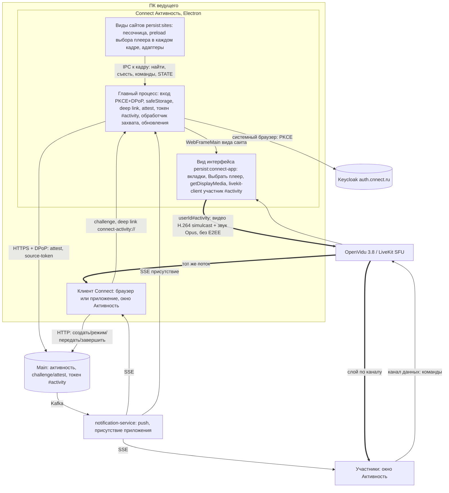
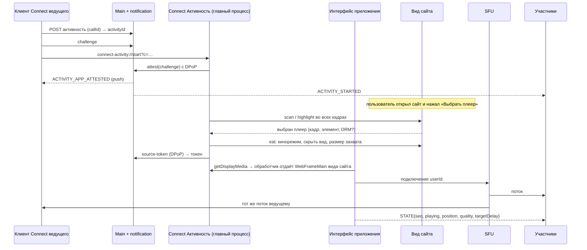

# Совместная активность Connect: анализ постановки activity-share

Редакция 3 от 6 октября 2026. Предмет: файл [`activity-share`](activity-share) — «Shared Activity — совместный просмотр через browser extension». В постановке приложение названо «Svyaz»; это Connect (cnnect.ru). Редакция 1 — коммит `2541ed5`, редакция 2 (расширение браузера) — `433705b`; полный текст про расширения остаётся там, здесь — коротко в приложении А.

## Что изменилось в третьей редакции

Пользователь выбрал **отдельное ПК-приложение «Connect Активность»** для Windows, Linux и macOS **со встроенным браузером** (Electron). Сайт с видео открывается прямо в приложении; приложение находит плеер, «съедает» его, снимает картинку и звук, управляет плеером и **само публикует поток в звонок Connect** отдельным участником. Зрители — любые клиенты Connect. Расширения браузера больше не основной путь — отложены (приложение А). Остальные решения редакции 2 сохраняются: ведущий смотрит поток через сервер синхронно со всеми; по умолчанию без сквозного шифрования (упор на задержку, потери, качество), переключатель «Шифровать трансляцию» (M3) — следующий этап; метка «Защищено»/«Без шифрования»; DRM не поддерживается.

## Главное за минуту

1. **Ключевое допущение подтверждено прототипом** (Electron 44.5.1 / Chromium 152, Linux, 6 октября, §2): вид сайта, скрытый от пользователя, снимается `session.setDisplayMediaRequestHandler` с источником `WebFrameMain` в **1920×1080 @ 60 к/с вместе со звуком вкладки** (стерео 48 кГц), без системного окна выбора, без разрешений ОС и с заглушённым локальным звуком (`local_echo=false`). Это захват отрисовки, а не элемента, поэтому **cross-origin не мешает**: HLS-плеер в iframe чужого домена снят в 1080p60. Перекрытое и свёрнутое окно приложения — те же 60 к/с.
2. **Публикация из приложения напрямую** (участник `<userId>#activity`, `livekit-client` внутри приложения) убирает loopback редакции 2 — одно кодирование вместо двух. Локально (LiveKit на той же машине, без сети) путь «отрисовка на сайте → показ у зрителя» — **p50 61 мс, p95 67–72 мс**, разброс между тремя зрителями **p95 6–17 мс**, потерь нет; H.264 simulcast 1080p60 ≈ 8 Мбит/с программным OpenH264. С общим буфером `jitterBufferTarget` 250 мс — 273–278 мс у всех, разброс p95 11 мс.
3. **Звук идёт, но позже видео на ~100 мс** (с буфером 250 мс — 60–70 мс): LiveKit не выравнивает дорожки даже с общим `stream`. Лечится у зрителя задержкой видео на измеренный перевес (S3 в T133).
4. **Три грабли, которые стоят времени**: LiveKit для источника `ScreenShare` молча берёт `h1080fps15` (2,5 Мбит/с, 15 к/с), если не передать `screenShareEncoding`; незакрытые кадры `MediaStreamTrackProcessor` держат буферы захвата и душат источник до 1,5 к/с; `getDisplayMedia` по умолчанию включает эхоподавление/шумодав/АРУ и даёт моно — для фильма это нужно выключить.
5. **Вход** — в системном браузере (RFC 8252, PKCE + DPoP, loopback-redirect), токены в `safeStorage`; связка со звонком — deep link `connect-activity://` + challenge/attest через Main, как в редакции 2, только вместо расширения — приложение. Встроенный браузер изолирован: отдельная сессия, песочница, `contextIsolation`, ни одного разрешения сайтам, fuses Electron.
6. **Поставка — главный нетехнический риск.** Windows: Microsoft Store (MSIX) бесплатно подписывает и снимает SmartScreen — лучший канал из РФ; Azure Artifact Signing для РФ недоступен, EV с 2024 не снимает SmartScreen. macOS: без Developer ID ($99/год) и нотаризации Gatekeeper с macOS 15 пускает только через «Конфиденциальность и безопасность», автообновление не работает; оплата Apple из РФ затруднена. Linux: AppImage/deb/rpm бесплатно, но песочница AppImage на Ubuntu 24.04+ упирается в AppArmor.
7. **Рекомендация.** MVP — приложение на Electron с захватом вида сайта и публикацией H.264 simulcast без E2EE; этап 0 — сборки под Windows/macOS и замер на настоящем звонке OpenVidu с зрителями на разных сетях. Параллельно — Microsoft Store и решение по подписи macOS.

## 1. Сценарий пользователя

1. В звонке Connect (приватный P2P или группа): «Активность» → «Просмотр видео с сайта».
2. Connect берёт у Main одноразовый challenge и открывает `connect-activity://start?c=…`. Если приложение ответило через Main (attest) — дальше; если нет — «Открыть Connect Активность» / «Установить приложение»; другой аккаунт — «Войти как @login». Ошибки на месте с «Повторить».
3. Приложение выходит на передний план: вкладка встроенного браузера, закладки популярных сайтов, плашка «Откройте видео и нажмите „Выбрать плеер“».
4. «Выбрать плеер» — подсветка всех плееров на странице, в iframe и shadow DOM; DRM помечен «Защищено».
5. Клик — плеер «съеден»: на вкладке снимок страницы с чёрным прямоугольником «Транслируется в Connect» и кнопкой «Вернуть плеер»; звук сайта у ведущего не играет. У всех, включая ведущего, в звонке открывается окно «Активность».
6. Управление из окна «Активность»: play/pause, перемотка, скорость, качество, «Пропустить» штатной кнопкой сайта, следующее/предыдущее; громкость у каждого своя. Права: «только я / все / модераторы», передача ведущего.
7. Пока идёт трансляция — другая вкладка для поиска следующего видео, «Сменить источник» без перезапуска.

## 2. Прототип: что проверено

Код, планы и сырые результаты: [`activity-share-prototype/electron/`](activity-share-prototype/electron/) (`main.js` — оркестратор и встроенный браузер, `site-preload.js` — выбор и «съедание» плеера в каждом кадре, `app.html` — интерфейс и публикация `livekit-client`, `viewer.html` — зритель с замерами, `server.js` — тестовые страницы и токены, `run.sh`, `plan-*.json`, `results/`, `shots/`). Запуск: `./run.sh plan-main.json` (нужны `npm i` и `livekit-server` 1.13.8 в каталоге).

**Стенд.** repos: AMD Ryzen 5 5600X (6 ядер / 12 потоков), 31 ГБ, NVIDIA GTX 1060 (драйвер 535), Ubuntu 24.04, GNOME на X11, PipeWire. GPU-процесс Electron на этой машине работал в программном режиме (композитинг, растр и все кодеки программные) — это худший случай для кодирования. LiveKit 1.13.8 `--dev` на той же машине: сети между участниками нет, в задержку входят захват, кодирование, SFU, буфер, декодирование и показ.

**Методика.** Тестовая страница рисует на холсте 1920×1080 движущуюся картинку и в верхней строке — штрихкод `Date.now()` (44 бита + инверсная строка для проверки), каждую секунду — щелчок 1 кГц по аудиочасам страницы. Приложение открывает страницу во встроенном браузере (вид `WebContentsView` в песочнице), preload в каждом кадре находит плеер, подсвечивает его (снимок `shots/…-1-highlight.png`), проверяет `captureStream()` внутри страницы, «съедает» плеер (кинорежим, вид скрыт, размер = размер захвата), интерфейс приложения показывает снимок с чёрным прямоугольником, вызывает `getDisplayMedia` (обработчик отдаёт `WebFrameMain` вида сайта), публикует видео и звук участником `u1#activity` в LiveKit. Три зрителя — отдельные окна с собственными сессиями — подписываются, в `requestVideoFrameCallback` читают штрихкод и время показа кадра, AudioWorklet ловит щелчки; раз в 2 с — `getStats` у отправителя и зрителей. Задержка = время показа у зрителя − время отрисовки на сайте (одни часы). Разброс — разница времени показа одного кадра у разных зрителей.

### 2.1. Захват вида сайта

| Проверка | Результат |
|---|---|
| Вид сайта скрыт (`setVisible(false)`), размер = 1920/scaleFactor × 1080/scaleFactor | 1920×1080, 60,1 к/с; `displaySurface: browser`, `getDisplayMedia` 10–70 мс без окна выбора |
| Вид видим или вынесен за пределы окна с размером окна | захватывается размер вида × scaleFactor (1624×1062 при 1300×850 и 1,25) — размер вида нужно задавать |
| Окно приложения перекрыто другими окнами / свёрнуто (`isMinimized: true`) | 60 к/с, без просадки |
| Звук вкладки | есть: стерео 48 кГц после выключения обработки; по умолчанию `echoCancellation/noiseSuppression/autoGainControl = true`, моно; `deviceId …?local_echo=false` — локально звук сайта заглушён |
| HLS (hls.js, MSE `blob:`) в верхнем кадре | 1920×1080 @ 59,8, звук есть |
| Тот же HLS в iframe **чужого домена** (OOPIF) | найден preload'ом iframe, кинорежим через родительский `<iframe>`, 1920×1080 @ 59,9, звук есть; пауза/воспроизведение командой в кадр iframe работают |
| `captureStream()` внутри страницы (для сравнения) | холст 60 к/с; HLS `blob:` 60,3 к/с со звуком, в том числе в iframe |
| mp4 с чужого домена без CORS | **не проверено**: во встроенном браузере файл не начал загружаться за 6 с, захват завис — разобрать на этапе 0. Вывод «cross-origin не мешает» опирается на iframe чужого домена и на устройство захвата (снимается композитный кадр вида, как вкладка в Chrome) |
| YouTube embed через прокси | **не проверено**: за 12 с плеер в iframe не найден (вероятно, страница согласия/проверка) — этап 0 |

### 2.2. Публикация и зрители (локальный LiveKit, 3 зрителя, 20–25 с)

| Случай | Кадров/с у зрителя | Разрешение | Задержка p50 / p95, мс | Разброс p50 / p95, мс | Звук позже видео, мс | Отправитель |
|---|---|---|---|---|---|---|
| H.264 simulcast, источник 60 к/с, вид скрыт | 55–57 (по `getStats` 60) | 1920×1080 | 61–65 / 67–72 | 5 / 11 | ~100 (звук 155–175) | OpenH264 ×3: 1080p60 ≈ 8,0, 540p60 ≈ 1,5, 360p30 ≈ 0,6 Мбит/с, `ql=none` |
| То же, окно перекрыто зрителями | 56 | 1920×1080 | 60–61 / 67–72 | 5 / 17 | ~100 | то же |
| То же, окно свёрнуто | 56–59 | 1920×1080 | 59–67 / 67–72 | 11 / 12 | ~100 | то же |
| H.264, источник 30 к/с | 30 | 1920×1080 | 49–50 / 54–67 | 0 / 22 | ~115 | 1080p30 ≈ 6,0 Мбит/с |
| H.264, `jitterBufferTarget` = 250 мс у видео и звука | 54–58 (60) | 1920×1080 | 273–278 / 284 | 6 / 11 | 60–70 | то же |
| VP9 SVC L3T3 (libvpx) | 53–54 | 1920×1080 | 61 / 67 | 5 / 11 | ~100 | 1 поток, `ql=none` |
| AV1 SVC L3T3 (libaom) | 37–38 | 1920×1080 | 72–75 / 78–83 | 5 / 11 | ~90 | 53 к/с на выходе кодера |
| VP8 simulcast (libvpx) | 39–42 | 1440×810 | 77–78 / 84–88 | 0 / 6 | ~95 | `ql=cpu` — программный VP8 1080p60 не держит |
| HLS 1080p60 (верхний кадр), 30 с | 50 | 960×540 | — (нет штрихкода) | — | — | верхний слой не включился: `ql=bandwidth`, разгон полосы |
| HLS в iframe чужого домена | 57 у отправителя | 1920×1080 | — | — | — | 1080p ≈ 7,6 Мбит/с |

Потерянных кадров у зрителей — 0–2 за прогон, потерь пакетов — 0 (локально). Задержка подписки 130–140 мс. Значения «Мбит/с» в `results-plan-main.jsonl` завышены (интервал считался неверно); верные — в `results-plan-sync.jsonl`.

### 2.3. Грабли, найденные прототипом

- **LiveKit и экран.** Для источника `ScreenShare` берётся `screenShareEncoding`, а не `videoEncoding`; без него — пресет `h1080fps15` (2,5 Мбит/с, 15 к/с). Первые прогоны дали ровно 15 к/с и 2,5 Мбит/с.
- **`MediaStreamTrackProcessor` и буферы захвата.** Если кадры не закрыты, а поток не отменён, устройство захвата остаётся без буферов и отдаёт 1,5 к/с. Мерить на клоне трека, `reader.cancel()`, `clone.stop()`.
- **Размер захвата** — это размер вида в физических пикселях; для 1080p скрытый вид ставится в 1920/scaleFactor × 1080/scaleFactor.
- **Звук `getDisplayMedia`** — по умолчанию с обработкой голоса и моно.
- **`incrementCapturerCount` в Electron 44 нет** (остался параметр `stayHidden` у `capturePage`); он и не нужен — активный захват сам держит скрытый вид в отрисовке.
- **Разгон полосы**: HLS-прогон 30 с оставался на 540p с `qualityLimitationReason=bandwidth` даже на localhost — стартовую оценку полосы нужно настраивать (этап 0).

### 2.4. Что прототип не проверял

Сеть (зрители на разных сетях, РФ), OpenVidu-стенд и клиенты Connect (веб, Android, iOS), Windows и macOS, аппаратные кодеры, CPU типичного ноутбука, mp4 без CORS, YouTube watch и embed, VK Видео/Rutube/Twitch в приложении (в редакции 2 проверены в Chromium-расширении), закрытый shadow DOM, эхо без наушников, Wayland, AppImage-песочница, TCC на macOS. Всё это — этап 0 (§11).

## 3. Архитектура приложения

### 3.1. Ментальная модель

Приложение — «руки и глаза» на сайте и одновременно отдельный участник звонка: встроенный браузер показывает сайт, preload в каждом кадре находит и «съедает» плеер, главный процесс отдаёт скрытый вид сайта как источник захвата, интерфейс приложения публикует видео и звук в комнату звонка от имени `<userId>#activity`. Клиент Connect ведущего (браузер или приложение Connect) остаётся там, где идёт звонок: кнопка «Активность», окно «Активность», команды. Main решает, кто ведущий и можно ли публиковать, и подтверждает, что приложение принадлежит тому же пользователю.

### 3.2. Контейнеры (C4 Container)

| Контейнер | Отвечает за | Почему граница здесь |
|---|---|---|
| Главный процесс | Вход, ключ DPoP и токены, deep link, attest, токен `#activity`, выбор кадра для команд, `setDisplayMediaRequestHandler`, обновления | Единственное место с доступом к ОС и секретам; виды его не видят |
| Виды сайтов | Сайт, preload поиска и «съедания» плеера, адаптеры, выполнение команд | Чужой код: песочница, своя сессия, без Node, без разрешений |
| Вид интерфейса | Вкладки, выбор, снимок с чёрным прямоугольником, захват, публикация, канал данных, `STATE` | Нужен WebRTC Chromium (simulcast, аппаратные кодеки, RED); получает только токен публикации |
| Клиент Connect ведущего | Кнопка «Активность», challenge, окно «Активность», подписка на `#activity`, команды | Там уже идёт звонок, M3, права и интерфейс звонка |
| Main | Активность, режим, ревизия, challenge/attest, выдача токена `#activity` | Права и единственность ведущего решает сервер |
| SFU | Раздача слоёв, канал данных | Без изменений |
| Зрители | Окно «Активность», буфер D, громкость, ducking, команды | Обычные подписчики |

### 3.3. Критический сценарий: запуск и первая картинка

Синхронные границы: создание активности и attest в Main (идемпотентно), выдача токена. Асинхронные: push участникам, публикация, первое `STATE`. Окно у участников открывается по push заранее, видео появляется по подписке на трек с атрибутом `activityId`.

### 3.4. Сессии и изоляция

- `persist:connect-app` — интерфейс приложения из пакета (`app://`), разрешения только `media`/`display-capture`, обработчик захвата отдаёт только вид сайта активной активности.
- `persist:sites` — все сайты; `setPermissionRequestHandler` → `false` для всего; `setWindowOpenHandler` — новая вкладка или запрет; `will-download` — отмена; навигация только `http/https`; обычный UA Chrome.
- Токены Connect живут в главном процессе; в вид интерфейса уходит только токен публикации `#activity` (без подписок и без доступа к чатам). Сайт не видит ничего от Connect: preload не выставляет API в main world, IPC принимает сообщения только от известных кадров и только из фиксированного словаря.

## 4. Захват: что выбрать

| Путь | Задержка | Качество | Cross-origin | Звук | Нагрузка | Вывод |
|---|---|---|---|---|---|---|
| **`setDisplayMediaRequestHandler` + `WebFrameMain`** (захват вида сайта) | ≤ 1 кадра (композитор → `MediaStreamTrack`), подтверждено ≈ 61 мс на всём пути | исходный кадр вида в заданном размере, до 60 к/с; кадр — то, что нарисовал сайт (плеер в кинорежиме) | не важен | звук именно этой вкладки, локально заглушён | одна копия кадра + кодер | **Основной** |
| `HTMLMediaElement.captureStream()` внутри страницы | без композитора, кадры декодера | исходное разрешение видео | `SecurityError` для чужих файлов без CORS (Chromium, ред. 2); `webSecurity: false` — не проверено и не рекомендуется (ломает безопасность сайтов) | до регулятора громкости | поток живёт в процессе сайта → нужен loopback или публикация из кадра сайта (токен в чужом процессе) | Запасной для оценки, не для MVP |
| `webContents.capturePage` / offscreen rendering (`paint`) | копии кадра в главный процесс; OSR — до 240 к/с, но кадры `NativeImage` | хорошее, но кадры надо вернуть в WebRTC (`MediaStreamTrackGenerator`) | не важен | звука нет — отдельный захват | высокая (CPU-копии), GPU-текстуры — только с нативным модулем | Не нужен |
| `desktopCapturer` по окну | системный захват окна (ScreenCaptureKit / WGC / PipeWire), +1–2 кадра | окно ОС, видна обвязка; окно должно быть на экране | не важен | системный loopback: только Windows/macOS 14.2+ (с `NSAudioCaptureUsageDescription`), в Linux нет | средняя | Нет: окно нельзя скрыть, звук не по ОС |

Почему кинорежим: захватывается вся отрисовка вида, поэтому выбранный плеер растягивается на весь скрытый вид в размере захвата (1080p, позже 4K). Пользователь видит не сам вид, а снимок страницы до «съедания» с чёрным прямоугольником — это и есть «на сайте чёрный прямоугольник». Для поиска следующего видео — другая вкладка.

## 5. Звук вкладки по ОС

| ОС | Источник `audio: WebFrameMain` | Системный loopback (`'loopback'`) | Комментарий |
|---|---|---|---|
| Linux | **есть** (проверено на PipeWire 1.x): звук снимается в аудиопотоке Chromium до вывода, от PulseAudio/PipeWire не зависит | нет (документация Electron: только Windows) | на системах без звукового сервера проверить на этапе 0 |
| Windows | есть (тот же механизм Chromium) | есть | системный loopback не нужен |
| macOS | есть (тот же механизм; не требует ScreenCaptureKit и TCC «Запись экрана» — проверить) | macOS 14.2+ через CoreAudio Tap, ключ `NSAudioCaptureUsageDescription`; до 12.7.6 — нет | системный loopback не нужен |

`enableLocalEcho: false` (по умолчанию) — локальный вывод звука вкладки выключен на время захвата; это и есть «звук не играет локально».

## 6. Публикация, кодеки, цифры

### 6.1. Как публикует приложение

- `livekit-client` в виде интерфейса приложения: отдельное подключение `<userId>#activity` с токеном от Main (`canPublishSources = [screen_share, screen_share_audio]`, без подписок), атрибуты `kind=activity`, `owner`, `activityId`, `encryption=none`. `@livekit/rtc-node` не подходит: нет доступа к захвату Chromium, кадры пришлось бы гнать через IPC.
- Видео: `source: ScreenShare`, `screenShareEncoding = { maxBitrate, maxFramerate, priority: "high" }`, `degradationPreference: "maintain-framerate"`, `contentHint = "motion"`, `stream: "activity-<id>"`, simulcast (1080/540/360) или `scalabilityMode` для VP9/AV1.
- Звук: `source: ScreenShareAudio`, Opus стерео 160 кбит/с (`forceStereo`), `red: true`, `dtx: false`, тот же `stream`.
- Ведущий в звонке подписывается на `#activity`, как все, — тот же путь и та же задержка.

### 6.2. Кодеки по ОС

| ОС | H.264 | VP9 / AV1 | HEVC |
|---|---|---|---|
| Windows | аппаратно (Media Foundation: Intel Quick Sync, AMD AMF, NVIDIA NVENC) | VP9 программно; AV1 аппаратно на новых GPU | Chromium WebRTC — за флагом, LiveKit/клиенты — проверить; не MVP |
| macOS | аппаратно (VideoToolbox, Apple Silicon и Intel) | VP9 программно; AV1 аппаратно на M3+ | VideoToolbox есть, тот же вопрос поддержки |
| Linux | VA-API (Intel/AMD) с `--enable-features=AcceleratedVideoEncoder`, «без гарантий»; NVIDIA — программно (OpenH264) | программно | нет |

Прототип (программно, Ryzen 5 5600X): OpenH264 1080p60 + 2 слоя — без `qualityLimitationReason=cpu`; VP9 SVC L3T3 1080p — ~53 к/с; AV1 (libaom) — ~37 к/с; VP8 1080p60 — упирается в CPU. Вывод: H.264 simulcast по умолчанию; VP9 SVC — если нет аппаратного H.264 и CPU сильный; AV1 — после MVP.

### 6.3. Потери и приоритет

NACK + RTX; RED для звука; FlexFEC для видео — эксперимент этапа 0 (+10–30 % трафика); `priority`/`networkPriority = "high"` у трека активности, камеры — ниже; у зрителей `adaptiveStream` держит активность в высоком слое. Разгон полосы: на HLS-прогоне верхний слой 30 с не включался (`bandwidth`) — на этапе 0 подобрать стартовую оценку (Chromium field trials в приложении нам доступны, флаги задаются при запуске).

### 6.4. Целевые цифры (пересмотр под приложение)

Loopback редакции 2 убран: −40–70 мс и одно кодирование. Бюджет без шифрования: захват ≤ 1 кадра (17–33 мс) + кодирование 5–15 мс аппаратно + путь до SFU и до зрителя 20–80 мс (РФ) + буфер D + декодирование и показ 15–30 мс. Прототип без сети: 61 мс p50 без D.

| Показатель | Было (ред. 2, расширение) | Стало (приложение), без шифрования | С шифрованием (этап 6) |
|---|---|---|---|
| Общий буфер D | 300 мс | **250 мс** (150–1500) | 350 мс |
| «Глаз-в-глаз» p50 / p95 | ≤ 400 / ≤ 700 мс | **≤ 350 / ≤ 600 мс** | ≤ 500 / ≤ 800 мс |
| Разброс между участниками, включая ведущего, p95 | ≤ 80 мс | **≤ 80 мс** (цель ≤ 40; локально 6–17) | ≤ 80 мс (ведущий тоже через SFU) |
| Звук относительно видео | −125…+45 мс | −125…+45 мс, цель ±45 мс (сейчас звук позже на 60–110 мс → компенсация) | то же |
| Команда → эффект у всех | ≤ D + 300 мс | ≤ D + 300 мс | то же |
| Первая картинка | ≤ 3 с | ≤ 3 с (подписка 130–140 мс локально) | ≤ 3 с |

Битрейты верхнего слоя не меняются: 1080p60 H.264 9–12 Мбит/с (на синтетике прототипа хватило 8), 1080p30 5–6, 720p30 2,5–3, 360p30 0,7–0,9; звук Opus стерео 160 кбит/с + RED. 60 к/с — при источнике 50/60 к/с и канале ≥ 15 Мбит/с.

## 7. Синхронность и эхо

- Ведущий смотрит поток через SFU, как все (без шифрования и с ним — у приложения своя идентичность), поэтому разброс определяется только сетью и буфером зрителей.
- `jitterBufferTarget = max(0, D − оценка_пути)` на видео и звук у каждого зрителя; отчёт задержки раз в 2–5 с, подъём D ступенями ≤ 100 мс. Прототип: с D = 250 мс у трёх зрителей 273–278 мс, разброс p95 11 мс.
- Губы: WebRTC не выровнял звук и видео `#activity` даже с общим `stream` (звук позже на ~100 мс, с D — 60–70). Компенсация у зрителя: `jitterBufferTarget` видео = D + перевес звука, перевес калибруется на этапе 0 по меткам (щелчок + вспышка) и обновляется по `getStats` (`jitterBufferDelay` звука и видео).
- **Эхо.** Звук фильма у ведущего не играет из приложения (`enableLocalEcho: false`, предпросмотр без звука). Он звучит только из окна «Активность» клиента Connect — удалённым треком WebRTC, который эхоподавление этого клиента видит и вычитает из микрофона. Если бы приложение играло фильм само, эхоподавление браузера про этот звук не знало бы — в микрофон звонка шёл бы фильм. Проверить без наушников на этапе 0 (Chrome, Edge, Firefox, Safari, Android, iOS).
- Приглушение под голос — локально у каждого, отдельный ползунок громкости фильма.

## 8. Вход и безопасность

### 8.1. Вход

- Клиент Keycloak `connect-activity-desktop`: публичный, Authorization Code + PKCE S256, `dpop_bound_access_tokens=true`, access 5 мин, refresh привязан к ключу, аудитория — только Main, scope `connect-activity`.
- По RFC 8252 вход — во **внешнем системном браузере**, не во встроенном окне: там уже есть сессия Connect (вход в один клик) и пароли/passkey пользователя, а приложение не видит ввод. Redirect — loopback `http://127.0.0.1:<случайный порт>/cb` (Keycloak с 24.0.8/25.0.6/26 сверяет loopback без порта), запасной — `connect-activity://auth/cb`.
- DPoP: ES256 в главном процессе, закрытый ключ и refresh — `safeStorage` (Windows DPAPI, macOS Keychain, Linux Secret Service/kwallet). На Linux с `basic_text` (нет хранилища) — не сохранять refresh. `keytar` заброшен — не использовать.
- Связка со звонком — challenge/attest через Main (как в ред. 2 для расширения): ни страница, ни сайт не могут подделать «приложение того же пользователя», а приложение не получает токенов вкладки Connect.

### 8.2. Встроенный браузер

По чек-листу безопасности Electron: `sandbox`, `contextIsolation`, без `nodeIntegration`, `webSecurity` включён, обработчик разрешений отказывает сайтам во всём, ограничение навигации и новых окон, без `shell.openExternal` для данных сайта, проверка отправителя каждого IPC, без `file://`, fuses (`RunAsNode`, `NODE_OPTIONS`, `--inspect` выключены, проверка целостности asar, только asar, шифрование cookie), актуальный Electron. Главный риск — уязвимости Chromium: приложение ходит по любым сайтам, поэтому обновления Electron с исправлениями безопасности — ≤ 7 дней, не отставать больше чем на 2 мажорные версии Chromium (это же требование политики Microsoft Store 10.2.1 для приложений, которые «browse the web»).

### 8.3. Ограничения встроенного браузера

- Google блокирует вход в аккаунт во встроенных браузерах («This browser or app may not be secure») — YouTube без входа (без Premium, без возрастных роликов).
- Антибот и «неподдерживаемый браузер» — обычный UA Chrome; Client Hints Electron — проверить.
- DRM: stock Electron без Widevine; castLabs ECS даёт Widevine с VMP, но Widevine при этом запрещает захват (чёрный кадр), а обход защиты — ст. 1299 ГК РФ. Не делаем.

## 9. Поставка

Проверено по официальной документации 6 октября 2026.

| ОС | Формат | Подпись и доверие | Автообновление | Риски |
|---|---|---|---|---|
| Windows | NSIS (`.exe`, x64/arm64); MSIX для Microsoft Store | Store (MSIX): Microsoft подписывает сам, без SmartScreen, аккаунт частного лица бесплатный. Вне Store: Azure Artifact Signing (~$9,99/мес) — только организации США/Канады/ЕС/Великобритании и частные лица США/Канады; OV ($150–300/год, ключ в HSM/токене) — у западных УЦ для РФ под вопросом; EV с 2024 не снимает SmartScreen; без подписи — «Windows защитила ваш компьютер» → «Подробнее» → «Выполнить в любом случае» | NSIS — `electron-updater` с generic-сервера; Store — сам Store | Store-ревью приложения со встроенным браузером: движок Chromium разрешён (10.2.1), держать свежесть |
| macOS | DMG + ZIP (universal или arm64/x64) | Developer ID + hardened runtime + нотаризация (`notarytool`); Apple Developer Program $99/год; с macOS 15 неподписанное приложение открывается только через «Системные настройки → Конфиденциальность и безопасность → Всё равно открыть» (Control-клик убран) | Squirrel.Mac через `electron-updater` — **только для подписанного приложения**; ZIP обязателен | Оплата из РФ: карты РФ не принимаются с 2022, с 1 апреля 2026 платежи App Store/медиасервисов Apple в РФ остановлены, ADEP закрыт для РФ с февраля 2025 → юрлицо/карта за рубежом. Mac App Store — песочница, захват вида — проверить |
| Linux | AppImage, deb, rpm; Flatpak (Flathub) позже | GPG-подпись репозитория deb/rpm (бесплатно); AppImage — по желанию GPG | AppImage — `electron-updater` без root; deb/rpm — через pkexec по кнопке; Flatpak — Flathub | Ubuntu 24.04+: AppArmor запрещает user namespaces → песочница Chromium в AppImage не стартует (нужен AppArmor-профиль, deb ставит его сам); Wayland; VA-API |

- Сборка — electron-builder на repos (без GitHub Actions); подпись Windows и нотаризация macOS требуют Windows/macOS-машины или облачных сервисов — решить на этапе 5.
- Размер: Electron 44 занимает 283 МБ на диске (проверено), установщик ≈ 100–120 МБ, обновление — дифференциальное (NSIS, AppImage — blockmap).
- Железо ведущего: 4 ядра, 8 ГБ ОЗУ, аппаратный H.264 (почти любой ПК после 2015 г.) или 6 ядер для программного 1080p60; канал вверх ≥ 10 Мбит/с для 1080p30.

## 10. Управление и адаптеры

Без изменений против ред. 2 (§6 там), только исполнитель — preload приложения в нужном кадре, а не content script:

| Сайт | Управление | Качество | Реклама |
|---|---|---|---|
| Generic HTML5 | `play/pause/currentTime/playbackRate`, события (проверено: пауза/воспроизведение в iframe чужого домена) | нет | нет |
| YouTube | объект плеера страницы (main world), запасной путь — `<video>` | внутренний API — хрупко | `.ad-showing`, штатная «Пропустить» по команде |
| VK Видео | `<video>` в shadow DOM; embed — `VK.VideoPlayer` | меню плеера — хрупко | штатная кнопка |
| Rutube | `<video>`; embed — `postMessage` (`player:play`, `player:setCurrentTime`, `player:changeQuality`) | `player:changeQuality` | штатная кнопка |
| Twitch | `<video>`; embed — Embed API | `setQuality` | не пропускается |

Команды и `STATE` — канал данных LiveKit, тема `connect.activity.v1`, адресат — `#activity`; формат и правила (ревизия, `cmdId`, ≤ 4 команды/с) — как в T133 C1–C4.

## 11. Этапы MVP и оценка

0. **Прототип и замеры (1–2 недели):** сборки прототипа под Windows/macOS; OpenVidu-стенд и настоящий звонок connect-ui с зрителями на веб/Android/iPhone на разных сетях; «глаз-в-глаз», разброс, калибровка звука; аппаратные кодеры и CPU; разгон полосы; эхо; сайты (YouTube watch, VK, Rutube, Twitch, mp4 без CORS); закрытый shadow DOM; TCC macOS; AppImage на Ubuntu 24.04.
1. **Каркас приложения (3–4 недели):** встроенный браузер, выбор и «съедание», захват, вход, deep link, attest, присутствие, публикация, сборки и автообновление (тестовый канал).
2. **Connect: активность без шифрования (2–3 недели):** веб-клиент, Main, токен, push, окно «Активность» во всех клиентах, `#activity` в M3-комнате.
3. **Синхронность и управление (2 недели).**
4. **Адаптеры (1–2 недели каждый).**
5. **Поставка (параллельно):** Microsoft Store, подпись/нотаризация, репозитории Linux, страница загрузки.
6. **«Шифровать трансляцию» (2–3 недели):** M3 в приложении.
7. **Дальше:** Flatpak, Mac App Store, 4K, HEVC/AV1, расширения браузера.

| Часть | Вероятность успеха | Трудоёмкость |
|---|---|---|
| Захват скрытого вида сайта со звуком, 1080p60 | **Высокая** (прототип, Linux) | — |
| То же на Windows/macOS | Высокая (тот же Chromium) | этап 0 |
| Публикация `#activity` и подписка ведущего | Высокая (прототип с LiveKit) | 2–3 недели вместе с Main |
| Разброс p95 ≤ 80 мс по сети | Средне-высокая | 2 недели, стенд |
| Звук/видео в ±45 мс | Средняя | калибровка этапа 0 |
| Вход PKCE + DPoP в системном браузере, attest | Высокая | 1 неделя + клиент Keycloak |
| Сайты в встроенном браузере (антибот, вход Google) | Средняя | тесты на каждом сайте |
| Подпись Windows через Microsoft Store | Средне-высокая | 1–2 недели ревью |
| Подпись и нотаризация macOS из РФ | **Низкая–средняя** (оплата) | зависит от юрлица |
| Linux-пакеты | Высокая (AppImage — с оговоркой AppArmor) | 1 неделя |
| «Шифровать трансляцию» | Средняя | 2–3 недели |

## 12. Риски

| Риск | Вероятность | Меры |
|---|---|---|
| Подпись Windows вне Store недоступна из РФ, SmartScreen пугает | Высокая | Microsoft Store (MSIX) как основной канал; прямой установщик с инструкцией; OV при появлении юрлица с доступом к УЦ |
| Оплата Apple Developer Program из РФ | Высокая | Юрлицо/карта за рубежом; иначе неподписанная сборка, инструкция Gatekeeper, без автообновления (баннер «есть новая версия») |
| Уязвимости Chromium во встроенном браузере | Средняя | Быстрые обновления Electron, песочница, fuses, без разрешений сайтам, автообновление обязательно |
| Сайты не пускают встроенный браузер (антибот, вход Google) | Средняя | Обычный UA, тесты; вход Google — ограничение продукта |
| Сайт в кинорежиме ведёт себя иначе (свой полноэкранный режим, мини-плеер, пауза) | Средняя | Адаптеры, тесты на каждом сайте |
| Разгон полосы — первые секунды в низком качестве | Средняя | Стартовая оценка полосы, флаги Chromium в приложении |
| Звук позже видео | Высокая (прототип) | Компенсация у зрителя, калибровка |
| Linux: AppArmor/AppImage, Wayland, VA-API | Средняя | AppArmor-профиль, deb/rpm, программный H.264 |
| Участник `#activity` ломает допуск M3 в клиентах | Средняя | Явный тип участника в roster/guard, тесты P2P и групп |
| Право: ретрансляция чужого контента | Средняя | Только приватные звонки, без записи, соглашение, жалобы, юрист до запуска (T129) |
| Сопровождение трёх ОС | Высокая со временем | Общий код, сборка на repos, тестовые каналы обновлений |

## 13. Отказы

| Точка сбоя | Что видит пользователь | Обнаружение | Восстановление |
|---|---|---|---|
| Приложение не установлено / не запущено / не вошли / другой аккаунт | Подсказка с действием | нет attest за 8 с, ответ Main | «Установить», «Открыть», «Войти как @login», «Повторить» |
| DRM | «Сайт защищает видео» | `mediaKeys` | Нет |
| Сайт пересоздал `<video>` | Короткая пауза | MutationObserver | Кинорежим для нового элемента, захват вида не прерывается |
| «Вернуть плеер» / вкладка закрыта | «Трансляция остановлена ведущим» | сообщение приложения, уход `#activity` | «Выбрать плеер снова» |
| Приложение упало / закрыто | «Ведущий отключился» | уход `#activity` | Перезапуск, повторный выбор; 60 с — завершение |
| Обрыв сети ведущего | Замирание, «Переподключаю…» | LiveKit reconnect | Автоматически, `STATE` после возврата |
| Токен `#activity` истёк | — | ответ SFU | Обновление по ревизии в главном процессе |
| Плохой канал | Ниже слой, D растёт ступенями | `getStats`, качество LiveKit | Автоматически |

## 14. Нагрузка на SFU, право, игры

- SFU: исходящий трафик ≈ (N зрителей + ведущий) × (слой + 0,2 Мбит/с). 1080p30 H.264 (5,5 Мбит/с): 4 участника ≈ 23 Мбит/с, 10 ≈ 57, 25 ≈ 143; 1080p60 — почти вдвое больше. MVP — до 10–16 участников, метрика «активностей и Мбит/с на активность», сверка с T129.
- Право (не юридическое заключение): ст. 1270 ГК РФ — показ в кругу семьи не публичен, звонок с посторонними выходит за этот круг; ст. 1299 — обход защиты запрещён (DRM не трогаем); ст. 1253.1 — положение информационного посредника; условия YouTube запрещают трансляцию вне сервиса. До запуска — юрист (T129).
- Совместные игры — без изменений с редакции 1 (`2541ed5`, §12).

## 15. Решения и альтернативы

| Решение | Альтернатива | Почему так | Когда пересмотреть |
|---|---|---|---|
| ПК-приложение Electron со встроенным браузером | Расширение браузера (ред. 2) | Решение пользователя; cross-origin не мешает; одно кодирование; нет ревью магазинов расширений | Если понадобится ведущий без установки или сессии сайтов пользователя |
| Захват вида сайта (`WebFrameMain`) в кинорежиме | `captureStream()` в странице | Нет ограничения CORS, звук вкладки, поток сразу в процессе публикации (прототип) | Если кинорежим ломает важные сайты |
| Приложение публикует само (`#activity`) | Передача потока в клиент Connect | Без loopback и второго кодирования; ведущий смотрит через SFU | — |
| Electron | Tauri, CEF, нативный WebView | Tauri на macOS — WKWebView без захвата вида; CEF — своя сборка; Electron даёт API захвата и сессий | — |
| `livekit-client` в виде интерфейса | `@livekit/rtc-node` | WebRTC Chromium: захват, simulcast, аппаратные кодеки | — |
| Вход в системном браузере (RFC 8252) | Окно входа в приложении | Сессия Connect уже есть, passkey/телефон, безопаснее | — |
| Microsoft Store как основной канал Windows | Свой подписанный установщик | Подпись бесплатно, без SmartScreen, доступно из РФ | Если появится OV/Artifact Signing |
| По умолчанию без E2EE | Всегда M3 | Качество, задержка, RED, проще | Этап 6 |

## Что нужно знать

- **Ответственность**: приложение — сайт, плеер, захват, публикация `#activity`, команды; клиент Connect — кнопка, окно «Активность», команды; Main — активность, attest, токен; SFU — раздача; зрители — буфер D, громкость, ducking.
- **Гарантии**: один источник для всех; ведущий смотрит поток с сервера; метка «Защищено»/«Без шифрования» у всех; сервер не хранит URL и позицию; токены Connect не попадают в виды сайтов.
- **Компромиссы**: ведущий — только ПК с приложением; YouTube без входа; «съеденная» вкладка — снимок; качество ограничено каналом и кодером ведущего; трафик SFU в 2–4 раза выше видеозвонка.
- **Что не делать**: DRM и castLabs ECS, блокировку рекламы, вход в чужие аккаунты внутри окна приложения для Connect, удалённый код адаптеров, отказ от автообновления.

## Приложение А. Расширения браузера (отложено)

Редакция 2 (`433705b`) — полный разбор: расширение MV3 для Chromium (Chrome, Edge, Opera, Яндекс Браузер), позже Firefox; content script в isolated world находит плеер (iframe, shadow DOM через `chrome.dom.openOrClosedShadowRoot`), «съедает» его и снимает `captureStream()`, поток уходит во вкладку Connect локальным WebRTC (loopback), вход — `launchWebAuthFlow` + PKCE + DPoP, связь — `externally_connectable`; магазины CWS ($5), Edge Add-ons, AMO, Opera.

Что подтвердил прототип ред. 2 (`activity-share-prototype/`, Chromium 147 и Firefox 156): `captureStream()` скрытого и заглушённого плеера в фоновой вкладке — HLS 1080p60 (и в iframe), YouTube embed 720p30, Rutube 480p25, VK Видео (shadow DOM) до 2160p25, Twitch 720p30, звук есть; loopback до 1080p60/1440p25 через 25 с; cross-origin mp4 без CORS — `SecurityError` (Chrome), трек без звука (Firefox).

Почему отложено: cross-origin без CORS в расширении снимается только целиком вкладкой (`tabCapture`), лишнее кодирование и разгон полосы на loopback, риск отказа CWS/Edge (политики дословно запрещают «unauthorized … streaming of copyrighted content»), оплата CWS из РФ, нет ведущего в Safari и на телефонах. Когда вернуться: ведущий без установки приложения, сессии сайтов пользователя (YouTube Premium, подписки). Общими с приложением держать адаптеры, протокол команд и `STATE`, challenge/attest.

## Источники и проверка фактов (6 октября 2026)

- Прототип: [`activity-share-prototype/electron/`](activity-share-prototype/electron/) — Electron 44.5.1 (Chromium 152.0.7977.130), livekit-client 2.22.3, livekit-server-sdk 2.19.1, LiveKit server 1.13.8, repos, 6 октября 2026; прототип ред. 2 — [`activity-share-prototype/`](activity-share-prototype/).
- Electron: [session — setDisplayMediaRequestHandler, streams.video/audio `WebFrameMain`, `enableLocalEcho`, loopback только Windows](https://www.electronjs.org/docs/latest/api/session); [desktopCapturer — звук по ОС, NSAudioCaptureUsageDescription, PipeWire](https://www.electronjs.org/docs/latest/api/desktop-capturer); [Offscreen rendering](https://www.electronjs.org/docs/latest/tutorial/offscreen-rendering); [safeStorage](https://www.electronjs.org/docs/latest/api/safe-storage); [Security checklist](https://www.electronjs.org/docs/latest/tutorial/security); [app — протоколы и deep link](https://www.electronjs.org/docs/latest/api/app).
- electron-builder: [Auto Update — цели по ОС, подпись macOS, generic, pkexec для deb/rpm](https://www.electron.build/docs/features/auto-update/).
- Windows: [Code signing options (обновлено 29.08.2026) — Store MSIX, Artifact Signing и страны, OV/EV, SmartScreen](https://learn.microsoft.com/en-us/windows/apps/package-and-deploy/code-signing-options); [Microsoft Store Policies, 10.2.1 — движок Chromium/Gecko, не старше 2 мажорных версий](https://learn.microsoft.com/en-us/windows/apps/publish/store-policy-archive/store-policy-7-16-1).
- Apple: [Notarizing macOS software](https://developer.apple.com/documentation/security/notarizing-macos-software-before-distribution); [Gatekeeper в macOS Sequoia (MacRumors)](https://www.macrumors.com/2024/08/06/macos-sequoia-gatekeeper-security-change/); [Apple прекратила платежи в РФ с 1.04.2026 (9to5Mac)](https://9to5mac.com/2026/04/02/apple-pulls-the-plug-on-all-payments-in-russia-following-government-diktat/); [ADEP закрыт для разработчиков из РФ (02.2025)](https://appleworld.today/2025/02/apple-closes-access-to-apple-developer-enterprise-program-adep-for-russian-developers/).
- Linux: [Chromium VA-API (`AcceleratedVideoEncoder`)](https://chromium.googlesource.com/chromium/src/+/refs/heads/main/docs/gpu/vaapi.md); [AppImage и AppArmor на Ubuntu 24.04](https://tamim.blog/post/understanding-ubuntu-24-04-appimage-sandbox-restrictions/).
- OAuth: [RFC 8252](https://datatracker.ietf.org/doc/html/rfc8252); [Keycloak: loopback-redirect без порта (issue #39880)](https://github.com/keycloak/keycloak/issues/39880).
- DRM: [castLabs: Widevine VMP](https://castlabs.com/security/widevine-certification/); [castLabs electron-releases](https://github.com/castlabs/electron-releases).
- Google и встроенные браузеры: [Rocket.Chat Electron — вход Google заблокирован](https://github.com/RocketChat/Rocket.Chat.Electron/issues/1526).
- LiveKit: `livekit-client` 2.22.3, `ScreenSharePresets.h1080fps15` как `screenShareEncoding` по умолчанию (исходник пакета).
- Источники ред. 2 (магазины расширений, API расширений, плееры) — в коммите `433705b`.
- Схемы Mermaid рендерером не проверялись (Mermaid CLI на repos нет).
