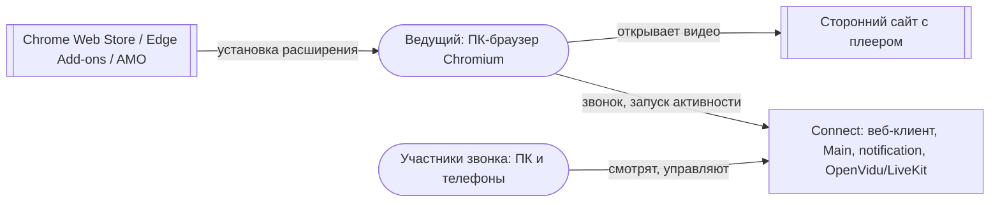
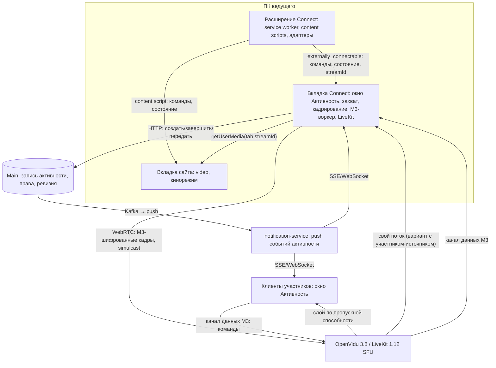
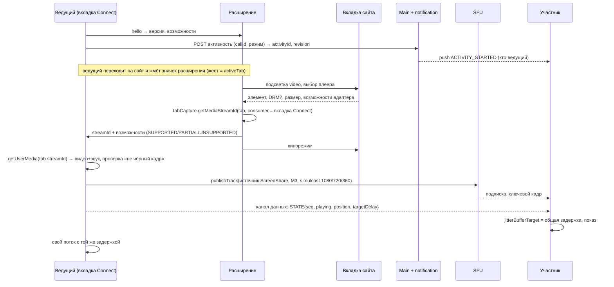

# Совместная активность Connect: анализ постановки activity-share

Дата: 6 октября 2026. Предмет: файл [`activity-share`](activity-share) — «Shared Activity — совместный просмотр через browser extension». В постановке приложение названо «Svyaz»; это Connect (cnnect.ru), ниже везде Connect.

Решение пользователя от 6 октября: вариант «каждый открывает плеер у себя» (watch party с синхронизацией состояния) **не рассматривается**. Анализируется только синхронная трансляция: ведущий с расширением захватывает плеер → поток идёт на SFU → его получают все участники, **включая ведущего**; управление плеером идёт от участников через Connect в расширение ведущего.

## Главное за минуту

1. **Идея реализуема для сайтов без DRM** (YouTube, VK Видео, Rutube, Twitch, прямые mp4/HLS, большинство сайтов с аниме) и только с **ПК-браузером Chromium у ведущего** (Chrome, Edge, Яндекс Браузер). Зрители — любой клиент Connect, включая телефоны: для них это обычный видеотрек звонка.
2. **Кинотеатры с DRM** (Кинопоиск, Okko, Иви, Wink, Start, Premier, Netflix и платные фильмы YouTube) — **не будут работать**: `captureStream()` для EME-контента бросает исключение, захват вкладки даёт чёрный кадр. Обходить защиту нельзя ни технически корректно, ни юридически (ст. 1299 ГК РФ). Это ограничение продукта, его надо честно показывать до старта.
3. **Самая выгодная архитектура — не та, что в постановке.** Расширение должно быть «руками и глазами» на сайте (выбор плеера, кадрирование, команды плееру), а **публиковать поток должен сам Connect** во вкладке звонка через уже работающий путь демонстрации экрана с E2EE M3. Тогда не нужен отдельный вход в расширение, токены Connect не попадают в расширение, не нужен второй M3-клиент в расширении, и всё шифрование, переподключение и проверки звонка переиспользуются.
4. **Синхронность «у всех одинаково, включая ведущего» достижима с разбросом порядка 100–150 мс** за счёт общей целевой задержки воспроизведения (`RTCRtpReceiver.jitterBufferTarget`) и оценки задержки каждого зрителя. Точно одинаковый путь для ведущего — если поток публикует отдельный участник-источник, а ведущий подписывается на него через SFU, как все. Это требует расширения M3 (вторая медиаидентичность устройства) и решения владельца архитектуры T45; для MVP достаточно локальной задержки показа у ведущего.
5. **Главные нетехнические риски** — публикация расширения в Chrome Web Store (политика запрещает продукты, которые «облегчают несанкционированную трансляцию защищённого контента») и авторское право (ретрансляция чужого контента). Оба снижаются формулировкой продукта («трансляция вкладки в приватный звонок»), минимальными правами, отказом от пропуска/блокировки рекламы как фичи, запретом в публичных комнатах и юридической проверкой до публичного запуска.
6. **Оценка вероятности**: трансляция вкладки в окно «Активность» — высокая; синхронность ±150 мс — средне-высокая; управление плеером generic HTML5 — средне-высокая; одобрение в CWS — средняя; универсальный пропуск рекламы — низкая (и не нужен); DRM-кинотеатры — практически нулевая.

## 1. Что требует постановка

### Требования

| # | Требование | Источник |
|---|---|---|
| R1 | Запуск из звонка: «Совместная активность → Совместный просмотр → Сторонний видеоплеер» | §3, §22 |
| R2 | Проверка, что расширение установлено и авторизовано, понятные сообщения | §3, §4, §22 |
| R3 | Расширение связано с аккаунтом Connect без хранения пароля, короткоживущий токен | §4 |
| R4 | Выбор плеера на странице: подсветка `<video>`, клик «Выбрать этот плеер» | §5 |
| R5 | Источник — `HTMLMediaElement.captureStream()`, видео и звук | §6 |
| R6 | Исходный плеер у ведущего скрыт (чёрная заглушка), но продолжает играть | §7 |
| R7 | Публикация `activity-video-{id}`/`activity-audio-{id}` в существующую комнату LiveKit | §8 |
| R8 | Окно Activity: видео, звук, play/pause, seek, громкость, полноэкранный режим, качество | §9 |
| R9 | Команды PLAY, PAUSE, SEEK, SET_RATE, SET_QUALITY, NEXT, PREVIOUS, MUTE, UNMUTE и команды адаптера | §10–§12 |
| R10 | Действия с рекламой только штатными средствами сайта, через адаптер | §13 |
| R11 | Site Adapters: Generic HTML5, YouTube, отдельные сайты | §14 |
| R12 | Серверное authoritative-состояние: state, position, rate, quality, controlMode, sequence | §15 |
| R13 | Режимы управления: только я / все / модераторы; в будущем — права по командам | §16 |
| R14 | Передача ведущего и обработка отказа ведущего | §17, §18 |
| R15 | Capability detection: SUPPORTED / PARTIALLY_SUPPORTED / UNSUPPORTED до старта | §21 |
| R16 | Безопасность: минимальные host permissions, TLS, sequence/request ID, серверная проверка прав | §23 |
| R17 | Ведущий смотрит тот же поток с сервера, что и все (уточнение пользователя 06.10) | решение пользователя |

### Допущения постановки и их проверка

| Допущение | Оценка |
|---|---|
| «Не screen sharing» даёт лучшее качество | Частично верно: `captureStream()` даёт кадры в исходном разрешении декодера независимо от размера плеера на экране. Но захват вкладки с плеером, растянутым на всё окно, даёт те же 1080p на мониторе 1920×1080. Разница в качестве невелика, а захват вкладки надёжнее в фоне и не зависит от устройства страницы. |
| `captureStream()` работает на целевых сайтах | Да для обычного MSE/HLS без DRM в Chromium; нет для EME (исключение `NotSupportedError`); трек «немой» для кросс-доменного медиа без CORS (спецификация требует muted). В Firefox — только с версии 149 (март 2026), в Safari — нет вовсе. |
| Скрытый плеер продолжает отдавать кадры | Спецификация: «скрытие элемента не останавливает захваченное видео, mute не даёт тишину». Но вкладка сайта у ведущего окажется **фоновой** (он смотрит во вкладке Connect), и Chromium может притормаживать фоновые вкладки. Нужен прототип; захват вкладки через `tabCapture` этой проблемы не имеет. |
| Расширение само публикует в LiveKit | Технически можно, но тогда расширению нужен LiveKit-токен, своя авторизация и **полноценный M3-клиент** (MLS-ядро Rust→WASM, допуск устройства, ключи кадров). Иначе трек пойдёт без E2EE, что нарушает правило «все звонки защищены». Это самая дорогая и рискованная часть постановки. |
| Сервер хранит authoritative position | Не нужно: истина о позиции — сам плеер у ведущего. Сервер должен хранить управляющее состояние (кто ведущий, режим, права, ревизия), а позицию и паузу ведущий рассылает участникам. Хранение позиции и названия сайта на сервере ещё и раскрывает, что смотрят, — против духа E2EE. |
| Громкость — команда плееру | Для `captureStream()` громкость элемента не влияет на захват; для захвата вкладки влияет. Правильно: громкость — **локальная настройка каждого зрителя**, а у источника всегда 100 %. |
| После PAUSE «LiveKit раздаёт последнее состояние» | SFU ничего не хранит: зрители видят последний полученный кадр. Окно должно знать о паузе из канала управления, иначе проверки здоровья медиа примут паузу за обрыв. |

## 2. Технические возможности браузеров

### Способы получить кадры плеера

| Способ | Что даёт | Ограничения | Вывод |
|---|---|---|---|
| `HTMLVideoElement.captureStream()` в content script | Видео в разрешении декодера и звук без системного микшера; элемент можно скрыть | EME → исключение; кросс-доменное медиа без CORS → muted-трек; плееры в iframe других доменов требуют `all_frames`; фоновая вкладка может тормозить декодирование; поток живёт в процессе вкладки сайта, переносить `MediaStreamTrack` в другую вкладку нельзя — нужен локальный RTCPeerConnection (лишнее кодирование) или публикация прямо из content script | Вариант на потом, после прототипа |
| `chrome.tabCapture.getMediaStreamId({targetTabId, consumerTabId})` + `getUserMedia` во вкладке Connect | Видео и звук всей вкладки сайта без системного окна выбора; звук вкладки у ведущего локально не играет; Chromium продолжает отрисовывать захватываемую вкладку и в фоне (подтвердить прототипом, этап 0) | Нужен жест пользователя на вкладке (activeTab), право `tabCapture`; захватывается вся вкладка — нужен «кинорежим» плеера или кадрирование; DRM → чёрный кадр | **Рекомендуется для MVP с расширением** |
| `getDisplayMedia()` с выбором вкладки во вкладке Connect | То же без расширения, звук вкладки в Chromium, `suppressLocalAudioPlayback` | Системное окно выбора, нет управления плеером и кадрирования; Firefox не отдаёт звук вкладки | Уже есть в Connect как демонстрация экрана; база этапа 1 |
| Region/Element Capture (`cropTo`/`restrictTo`) | Кадрирование по элементу силами браузера | Работает **только при захвате собственной вкладки** (`preferCurrentTab`): RestrictionTarget из другой вкладки нельзя применить к захвату | Не подходит: плеер в чужой вкладке |
| Кадрирование `VideoFrame` (`MediaStreamTrackProcessor` + `visibleRect` + `MediaStreamTrackGenerator`) во вкладке Connect | Вырезать прямоугольник плеера из захвата вкладки по координатам от расширения | Только Chromium; координаты меняются при прокрутке и смене раскладки — нужен ResizeObserver в content script | Запасной вариант к «кинорежиму» |

**«Кинорежим» вместо чёрной заглушки.** При захвате вкладки элемент нельзя прятать: захватится чёрное. Вместо заглушки расширение растягивает выбранный плеер на всё окно вкладки (`position: fixed; inset: 0; object-fit: contain`, чёрный фон, скрытые оверлеи сайта). Ведущий в эту вкладку не смотрит — он смотрит окно «Активность» в Connect, а звук вкладки при захвате у него локально выключен. Для плееров в iframe чужого домена расширение растягивает сам iframe (content script верхнего кадра) и видео внутри (content script кадра).

### DRM и что будет работать

| Источник | Ожидание | Почему |
|---|---|---|
| YouTube (обычные ролики) | Работает | MSE без DRM; тот же источник в одной вкладке |
| YouTube Movies/платные фильмы | Чёрный кадр | Widevine |
| VK Видео, Rutube (пользовательские ролики) | Скорее работает | Обычно без DRM; лицензионные сериалы могут быть защищены |
| Twitch, прямые mp4/HLS | Работает | Без DRM |
| Сайты с аниме и встроенными плеерами (часто iframe сторонних доменов) | Технически часто работает | Нет DRM, но плеер в iframe; правовой статус многих таких сайтов сомнителен |
| Кинопоиск, Okko, Иви, Wink, Start, Premier, Netflix, Disney+, Prime Video | Не работает | Widevine/PlayReady: `captureStream()` бросает исключение, захват вкладки даёт чёрный кадр |

Проверка возможности до старта (R15): у выбранного элемента `video.mediaKeys !== null` или ошибка `captureStream()` → UNSUPPORTED с текстом «Сайт защищает видео от трансляции. Совместный просмотр этого сайта невозможен». Через 2–3 секунды после старта — проверка, что кадры не чёрные (средняя яркость по уменьшенному кадру) → PARTIALLY_SUPPORTED с предупреждением. Ошибка показывается на месте, без блокирующих экранов и с кнопкой «Повторить» (правило Connect о прозрачных ошибках).

### Браузеры ведущего

| Браузер | Ведущий | Зритель |
|---|---|---|
| Chrome, Edge, Яндекс Браузер, Opera (ПК) | Да: `tabCapture`, звук вкладки, `VideoFrame`, `jitterBufferTarget` | Да |
| Firefox (ПК) | Не в MVP: нет `tabCapture`, `getDisplayMedia` не отдаёт звук вкладки; `captureStream()` только с 149 | Да |
| Safari (macOS) | Нет: нет `captureStream()` и звука вкладки | Да (H264-слой) |
| Телефоны и планшеты | Нет | Да — обычный видеотрек звонка |

## 3. Рекомендуемая архитектура

### Ментальная модель

Есть **один источник** — вкладка сайта у ведущего. Расширение отвечает за то, *что* захватывать и *как* управлять плеером. Вкладка Connect у ведущего отвечает за то, *как* доставить: она получает захват вкладки, при необходимости кадрирует, шифрует M3 и публикует в звонок. SFU раздаёт. Каждый зритель, включая ведущего, держит одну и ту же общую задержку показа. Команды управления идут по зашифрованному каналу данных звонка к ведущему, ведущий — единственный, кто применяет их к плееру.

### Контекст (представление C4 Context)

Connect не обращается к стороннему сайту и не знает URL видео: сайт открыт только у ведущего.

### Контейнеры (представление C4 Container)

| Контейнер | Ответственность | Данные | Почему здесь граница |
|---|---|---|---|
| Расширение | Выбор плеера, кинорежим/кадрирование, адаптеры, выполнение команд, отчёт о состоянии плеера, выдача `streamId` захвата | Ничего не хранит, кроме настроек; **токенов Connect нет** | Только расширение имеет доступ к чужой странице; держим в нём минимум логики и прав |
| Вкладка Connect ведущего | Захват вкладки, публикация трека активности с E2EE M3, рассылка состояния, проверка прав на команды, общая задержка | Состояние активности в памяти | Здесь уже есть авторизация, комната, M3, переподключение, проверки медиа |
| Main | Запись «активность идёт в звонке X, ведущий Y, режим Z, ревизия N», права, передача ведущего, завершение | Таблица активностей звонка; без URL и позиции | Права и единственность ведущего должны решаться на сервере, а не голосованием клиентов |
| notification-service | Push «активность началась/сменился ведущий/завершена» | — | Правило Connect: push вместо поллинга |
| SFU | Раздача слоёв, подписки, канал данных | Не видит содержимого (E2EE) | Без изменений сервера |
| Клиент зрителя | Окно «Активность», общая задержка, локальная громкость и приглушение под голос, отправка команд | — | Обычный подписчик |

### Связь расширения и Connect

- `externally_connectable` с `matches: ["https://cnnect.ru/*", "https://*.cnnect.ru/*"]`: страница Connect находит расширение по ID (`chrome.runtime.sendMessage(EXT_ID, {type:"hello"})`), получает версию и возможности. Это закрывает R2 без отдельного входа.
- **Авторизация расширения (R3) не нужна.** Расширение не ходит в API Connect: всё сетевое делает уже авторизованная вкладка Connect. Это снимает целый класс рисков (кража токена расширения, отзыв, refresh). Если позже понадобится работа расширения без открытого Connect — тогда вводить привязку по одноразовому коду из постановки.
- Защита канала: расширение принимает сообщения только от origin Connect (проверка `sender.origin`), только от вкладки, где сейчас идёт звонок с активностью, и только из фиксированного словаря команд. Никакого произвольного JS, селекторов или URL из сети — это и требование CWS (запрет удалённого кода), и защита от XSS на cnnect.ru, через который иначе можно было бы управлять расширением.

### Критический сценарий: запуск и первая картинка

Синхронные границы: создание активности в Main (ответ с ревизией, повтор с тем же ключом идемпотентности = тот же activityId). Асинхронные: push участникам, публикация трека, первое состояние. Видео появляется у участника по факту подписки на трек с атрибутом `activityId`, а не по push: push лишь открывает окно заранее, чтобы оно не «прыгало» (критерий плавности).

### Управление

- Команды (R9): `PLAY`, `PAUSE`, `SEEK(t)`, `SEEK_REL(±10 c)`, `SET_RATE`, `NEXT`, `PREV`, `SKIP_AD` (только штатная кнопка, см. ниже), `SET_QUALITY` (если адаптер умеет). **Громкость и mute — локальные у каждого зрителя**, не команды.
- Транспорт: `publishData` канала данных LiveKit, `reliable: true`, тема `connect.activity.v1`, адресат — ведущий; содержимое шифруется тем же M3-воркером, что и данные звонка (в воркере уже есть `encryptDataRequest`). Название сайта и позиция не уходят на сервер открытым текстом.
- Формат команды: `{activityId, revision, cmdId (UUID), from, kind, args, baseSeq}`. Ведущий: проверяет режим и права по записи активности (ревизия из Main), отбрасывает повтор `cmdId`, применяет через расширение, затем рассылает `STATE{seq+1, playing, position, rate, duration, ad, capabilities, by}`. Конфликт двух SEEK решается порядком прихода к ведущему: каждый видит, чья команда победила (`by`).
- Отклик: команда идёт ≈ RTT/2 до ведущего, применение 10–50 мс, затем эффект виден через общую задержку (0,4–0,8 с). Чтобы управление не казалось «ватным», окно сразу показывает оптимистичное состояние («Пауза…», ползунок на новом месте) и подтверждает его по `STATE`.
- Права (R13): режим хранится в Main и проверяется дважды — Main при смене режима/ведущего, ведущий при каждой команде. Злоупотребления: ограничение частоты команд от одного участника (например, 4 в секунду), ведущий может забрать управление одним нажатием.
- Пауза и проверки медиа: при паузе захват вкладки продолжает присылать кадры (картинка стоит), при `captureStream()` кадры прекращаются. Окно «Активность» и проверка здоровья медиа должны учитывать `STATE.playing=false`, чтобы не показывать «Нет сигнала» и не переподключаться.

### Реклама (R10)

Разрешить только действия, которые сделал бы сам ведущий: нажать **видимую штатную кнопку «Пропустить»** в адаптере YouTube, когда сайт её показывает. Без блокировки рекламы, без перемотки рекламы, без подмены запросов. В описании расширения пропуск рекламы не упоминать как функцию: это уменьшает риск отказа в магазине и претензий площадок. Универсальный механизм для любых сайтов невозможен, и постановка это верно признаёт.

### Передача ведущего и отказ (R14)

- Передача: A предлагает → B принимает в своём окне → B выбирает плеер у себя → Main меняет ведущего с ревизией (CAS) → A снимает публикацию. Зрители переключаются на трек B по атрибуту `activityId`; короткая чёрная пауза неизбежна, показывать «Ведущий меняется».
- Отказ источника: трек закончился (ведущий нажал «Остановить» в панели Chrome, закрыл вкладку сайта), расширение сообщило «элемент пропал» → вкладка Connect ведущего публикует `SOURCE_LOST` и предлагает «Выбрать плеер снова». Отказ вкладки Connect ведущего: участник пропал из комнаты → у зрителей «Ведущий отключился», кнопка «Стать ведущим» для имеющих право, через 60 с без ведущего Main завершает активность.
- Переход на следующую серию в той же вкладке: захват вкладки переживает навигацию, но content script нужно внедрить снова; для этого при выборе плеера расширение просит разрешение на сайт (`optional_host_permissions` для конкретного origin), а не держит `<all_urls>`.

## 4. Синхронность: одинаковая задержка у всех, включая ведущего

### Откуда берётся разброс

Задержка показа у зрителя = кодирование у ведущего + путь ведущий→SFU + пересылка + путь SFU→зритель + джиттер-буфер + декодирование и вывод. Различаются у зрителей в основном путь до SFU (5–100 мс) и адаптивный джиттер-буфер (40–300 мс, плавает со временем). Без мер разброс 100–400 мс и меняется во время просмотра. У ведущего, если он смотрит свой локальный поток, задержка почти нулевая — он опережает всех.

### Механизм выравнивания

1. **Общая целевая задержка D** (по умолчанию 500 мс, диапазон 300–1500 мс). Ведущий объявляет D в `STATE`.
2. **Каждый зритель** ставит на приёмники видео и звука трека активности `RTCRtpReceiver.jitterBufferTarget = max(0, D − оценка_сети)`. Оценка сети ≈ RTT ведущего/2 + RTT зрителя/2 + задержка кодирования (из `getStats`: `currentRoundTripTime`, `totalEncodeTime/framesEncoded` у ведущего через его `STATE`). Буфер в Chromium ограничен 4 с; звук и видео одного участника синхронизирует WebRTC (lip-sync), если они в одной группе синхронизации — проверить для трека экрана и звука экрана в LiveKit.
3. **Обратная связь**: раз в 2–5 с зритель сообщает ведущему свою фактическую задержку (оценка + `jitterBufferDelay/jitterBufferEmittedCount`). Если кто-то не укладывается в D (плохая сеть), ведущий поднимает D для всех ступенькой и плавно (изменение `jitterBufferTarget` даёт растяжку времени, без рывков, если шаг ≤ 100 мс).
4. **Ведущий** смотрит с той же задержкой D:
   - **MVP: локальная задержка показа.** Ведущий не может подписаться на собственный трек в той же идентичности LiveKit. Поэтому вкладка Connect задерживает свой локальный кадр: видео через очередь `VideoFrame` (`MediaStreamTrackProcessor` → `MediaStreamTrackGenerator`), звук через `DelayNode` в WebAudio, на D − (свой RTT/2). Ошибка ±50 мс, путь не идентичен остальным, но для просмотра достаточно.
   - **Точный вариант: отдельный участник-источник.** Вкладка Connect ведущего поднимает второе подключение к той же комнате с идентичностью `<userId>#activity` (только публикация, без подписок), а основная идентичность ведущего подписывается на этот трек через SFU, как все. Тогда у ведущего тот же путь и тот же механизм D, а фильм приходит как удалённый WebRTC-звук — его видит эхоподавление (см. звук). Цена: ведущий получает свой поток (+3–6 Мбит/с вниз), сервер выдаёт второй токен с правами только на публикацию экрана, **M3 должен допустить вторую медиаидентичность устройства** (сейчас источник медиа привязан к устройству). Это изменение криптографического протокола T45 — только по решению владельца архитектуры шифрования.
5. **Точнее, если понадобится**: метка времени захвата. В воркере M3 отправитель видит каждый кадр; можно раз в секунду рассылать по каналу данных пару «RTP timestamp ↔ время по часам сервера», а у зрителя брать `requestVideoFrameCallback` (`rtpTimestamp`, `presentationTime`). Сложность: SFU перенумеровывает RTP-время при смене слоя simulcast. Делать только если оценки по статистике не хватит.

### Допустимый разброс

| Что сравниваем | Цель | Почему |
|---|---|---|
| Разброс показа между любыми двумя участниками, включая ведущего | p95 ≤ 150 мс (MVP), ≤ 80 мс (точный вариант) | Реакции в голосе («ха-ха», «смотри!») сами идут с задержкой 150–300 мс; разница меньше этой незаметна |
| Синхронность звука и видео внутри потока | от −125 до +45 мс (звук позже/раньше), как ITU-R BT.1359 | Порог заметности рассинхрона губ |
| Задержка от команды до эффекта у всех | ≤ D + 300 мс | Иначе управление кажется сломанным |
| Общая задержка D | 300–800 мс в нормальной сети | Зритель не видит «прямого эфира», ему важно одинаково со всеми |

## 5. Качество

| Параметр | Рекомендация | Текущее в Connect |
|---|---|---|
| Кодек | Защищённые звонки — VP8 (iPhone — H264). Для 1080p30 фильма VP8 программно тяжёл; предложить H264 с аппаратным кодированием на ПК ведущего, если он есть, выбор при публикации трека | `protectedVideoCodec()` = vp8, H264 для Apple |
| Слои | Simulcast 1080p30 ≈ 4,5 Мбит/с, 720p30 ≈ 2 Мбит/с, 360p ≈ 0,6 Мбит/с; SFU выдаёт слой по сети зрителя, телефонам — 720/360 | Экран: `maxBitrate 4 Мбит/с, 30 к/с, simulcast: false, maintain-resolution, contentHint "detail"` |
| Подсказки | `contentHint = "motion"`, `degradationPreference = "maintain-framerate"` — это кино, а не текст | Для экрана сейчас «detail» — для фильма даёт рывки при нехватке канала |
| FPS | Как у источника (24/25/30), потолок 30 | 30 |
| Разрешение | 1080p при исходящем канале ведущего ≥ 10 Мбит/с, иначе верхний слой 720p; проверка оценки канала до старта и предупреждение | — |
| Звук | Opus стерео 128–160 кбит/с, без DTX, без шумоподавления/AGC/эхоподавления на источнике | Звук экрана сейчас без RED в E2EE (`M3-CALL-STATUS`) |
| Ключевые кадры | По входу зрителя — PLI (SFU делает сам), ключевой кадр не реже раза в 2–4 с не нужен | — |

Исходящий канал ведущего — главный ограничитель: simulcast 1080/720/360 ≈ 7–8 Мбит/с вверх плюс его камера и голос. На домашнем ADSL или мобильном модеме — только 720p. Кодирование 1080p simulcast VP8 занимает 1,5–2 ядра; на слабом ноутбуке выбирать 720p. Замечено на стенде T83: одновременные камера и экран на слабой машине кодируются с 1–2 к/с — это ресурс машины, а не код; значит, нужен замер на типичном ПК ведущего.

## 6. Звук фильма и голос звонка

- **Приглушение под голос (ducking)**: у каждого зрителя локально, когда кто-то говорит (уровень/active speaker LiveKit), фильм −10 дБ, атака 50 мс, отпускание 500 мс; переключатель «Приглушать фильм, когда говорят» и отдельный ползунок громкости фильма. Это локальная обработка, ведущему ничего не отправляется.
- **Эхо**: фильм у каждого играет из динамиков и попадает в микрофон. Эхоподавление Chromium вычитает только тот звук, который сам WebRTC выводит как удалённый звук; звук, прошедший через собственную WebAudio-цепочку, оно может не видеть. Значит:
  - у зрителей звук фильма — удалённый трек; надо проверить, как Connect воспроизводит удалённый звук (элемент или AudioContext), и при необходимости выводить трек активности элементом, чтобы он попадал в опорный сигнал эхоподавления;
  - у ведущего в MVP фильм идёт через `DelayNode` (WebAudio) — велик риск, что его микрофон отправит фильм обратно всем с другой задержкой. Меры: рекомендовать наушники, голосовой гейт и «ИИ 2.0» частично это гасят; надёжно — вариант с участником-источником (фильм у ведущего становится обычным удалённым треком).
- Звук вкладки у ведущего локально не воспроизводится (`tabCapture` глушит вкладку, для `getDisplayMedia` — `suppressLocalAudioPlayback: true`), иначе он слышит фильм дважды: сразу из вкладки и через D из окна Активности.

## 7. E2EE M3 для трека активности

- Демонстрация экрана и звук экрана в P2P/групповых звонках уже идут через M3-воркер (`M3-CALL-STATUS.md`, 02.10). Трек активности публикуется как источник `ScreenShare`/`ScreenShareAudio` с атрибутом `activityId` — **шифрование получается без изменений протокола**.
- Не закрыто в M3 сейчас: голосовые каналы комнат и гостевые встречи не имеют пути `configureM3`. Значит, активность в них в MVP не включать или ждать их перевода на M3.
- Simulcast и E2EE совместимы для VP8/H264 (шифруется полезная нагрузка, заголовки RTP открыты). SVC (VP9/AV1) с E2EE требует открытого dependency descriptor — отложить.
- Если ведущий выбрал режим «Не шифровать» (T130), трек активности идёт без E2EE, и участники видят ту же метку «Без шифрования».
- Канал команд и состояния — шифровать M3 (данные звонка): по ним видно, что и где смотрят.
- Вариант «участник-источник» и вариант «расширение публикует само» требуют новой медиаидентичности в M3 — изменение криптографии T45; без решения владельца архитектуры шифрования не начинать.

## 8. Нагрузка на SFU

SFU только пересылает (с E2EE перекодирование невозможно в принципе). Исходящий трафик сервера ≈ N зрителей × (слой + 0,15 Мбит/с звука):

| Участников (включая ведущего) | 1080p у всех | 720p у всех |
|---|---|---|
| 4 | ≈ 19 Мбит/с | ≈ 9 Мбит/с |
| 10 | ≈ 47 Мбит/с | ≈ 22 Мбит/с |
| 25 | ≈ 116 Мбит/с | ≈ 54 Мбит/с |

Это в 2–4 раза больше, чем видеозвонок с камерами на 360p в том же составе. Входящий — один поток от ведущего. Рекомендации: в MVP ограничить активность звонками до 10–16 участников; включить `adaptiveStream`/`dynacast`, чтобы скрытое окно Активности (свёрнуто, вкладка в фоне) получало нижний слой или ничего; сверить ёмкость узла OpenVidu с T129 (прод-кластер) и добавить метрику «активностей и исходящих Мбит/с на активность».

## 9. Безопасность и права расширения

| Риск | Мера |
|---|---|
| Широкие права «читать и изменять данные на всех сайтах» отпугивают и усложняют ревью | `activeTab` + `scripting` + `tabCapture`; доступ к конкретному сайту через `optional_host_permissions` по запросу при выборе плеера; без `<all_urls>` в обязательных правах |
| Участник звонка управляет вкладкой ведущего | Только фиксированный словарь команд к выбранному элементу; без навигации на URL из сети, без произвольных кликов и скриптов; права по режиму; ограничение частоты; ведущий видит, кто нажал |
| XSS на cnnect.ru управляет расширением | Расширение доверяет только вкладке с активным звонком и активностью, подтверждённой жестом ведущего; команды — только к уже выбранному плееру |
| Утечка содержимого сайта ведущего | Захват вкладки отдаёт **всё**, что на ней видно (в том числе личные данные, если ведущий перейдёт на другую страницу в этой вкладке). Кинорежим, индикатор «Транслируется» поверх вкладки, автостоп при переходе на другой origin |
| Утечка токенов Connect | Токенов в расширении нет |
| Удалённый код | Адаптеры поставляются в пакете расширения, обновление — новой версией (правило CWS) |
| Злоупотребления (порно, насилие в общем звонке) | Активность может запустить только участник звонка; в группах — по праву (модераторы); жалоба на активность; в публичных комнатах/каналах — выключено |

## 10. Магазины расширений

- **Chrome Web Store** — единственный способ поставки для обычных пользователей Chrome на Windows/macOS (установка извне — только корпоративными политиками). Политика запрещает продукты, которые «поощряют, облегчают или позволяют несанкционированный доступ, загрузку или трансляцию защищённого авторским правом контента», и отдельно — скачивание с YouTube. Расширение «ретрансляция любого видео в другой сервис» близко к этому описанию. Блокировщики и «пропуск рекламы» в магазине при этом есть — сам по себе клик по кнопке «Пропустить» не запрещён, но привлекает внимание ревьюеров.
  - Позиционирование: «Подключить вкладку к звонку Connect и управлять плеером вместе с участниками», единственная цель, без слов «фильмы, аниме, бесплатно».
  - Права минимальные, политика конфиденциальности, видеоролик для ревью, ответ о `tabCapture` и `scripting`.
  - Риск: отказ или снятие после жалобы правообладателя. План Б: ПК-клиент Connect (Electron/Tauri), где тот же захват делается без магазина.
- **Edge Add-ons, каталог Opera/Яндекс Браузера** — та же сборка, обычно мягче; Яндекс Браузер ставит расширения из CWS и каталога Opera.
- **Firefox AMO** — после появления в Firefox аналога захвата вкладки со звуком; в MVP не нужен.
- **Safari** — не делать.

## 11. Право (не юридическое заключение)

- Ретрансляция чужого видео участникам — это передача копии произведения третьим лицам. По ГК РФ показ «в обычном круге семьи» не является публичным (ст. 1270 п. 2 пп. 6), но звонок с посторонними людьми, открытые комнаты и каналы уже выходят за этот круг. Обход технических средств защиты запрещён отдельно (ст. 1299) — отсюда жёсткий отказ от DRM-обхода.
- Connect как площадка может претендовать на положение информационного посредника (ст. 1253.1): он не инициирует передачу, не выбирает контент и должен реагировать на обоснованные претензии. E2EE не мешает выполнить требование «прекратить» на уровне функции (выключить активность в звонке/для аккаунта), но не позволяет проверить, что транслировалось.
- Правила площадок: условия YouTube запрещают передавать и транслировать контент вне сервиса без разрешения. Риск — для пользователя и для репутации Connect; техническая блокировка со стороны площадки маловероятна, но возможна претензия к расширению в CWS.
- YouTube в РФ замедлен: в этой схеме доступ к сайту нужен только ведущему, участники получают поток от Connect. Это удобно, но усиливает впечатление «обход ограничений через Connect» — формулировки продукта и маркетинга должны это учитывать.
- Меры: только приватные звонки и группы, лимит участников, выключено в публичных комнатах и каналах, нет записи и архива активности, пункт пользовательского соглашения об ответственности за транслируемый контент, процедура жалоб и отключения. **До публичного запуска — заключение юриста** (в T129 уже есть пункт «юридическое заключение»).

## 12. Совместные игры-активности (собственный магазин)

В файле постановки игр нет; это второе направление из идеи пользователя, анализ — для будущей отдельной задачи.

- **Модель Discord Activities**: игра — веб-приложение в iframe на отдельном домене (например, `<appId>.apps.cnnect.ru`), SDK общается с Connect через `postMessage`; все сетевые запросы игры идут через прокси Connect (скрытие IP участников, строгая CSP, блок известных вредных адресов); авторизация — `authorize()` → одноразовый код → бэкенд игры обменивает его на токен с ограниченными областями (профиль, участники звонка), без доступа к чатам и ключам.
- **SDK Connect**: участники звонка и их вход/выход, кто говорит, локальное приглушение голоса, приглашение в активность, общий канал сообщений игры, хранилище состояния комнаты, покупки (позже).
- **Синхронизация**: для пошаговых и карточных игр — ведущий клиент как authoritative и канал данных звонка (дёшево, шифруется M3); для игр на ловкость и с призами — authoritative-сервер игры (WebSocket через прокси), потому что клиент-ведущий может жульничать. Детерминированный lockstep — только для своих игр с общим движком. Честно: authoritative-сервер видит состояние игры открытым текстом — сообщать пользователю, что игра не защищена сквозным шифрованием Connect.
- **Магазин и модерация**: начать с 3–5 собственных игр (рисовалка-угадайка, викторина, «Шпион»/«Кодовые имена», шашки), на них отладить SDK; сторонних разработчиков — после ревью-процесса (проверка кода и доменов, возрастные метки, аварийное отключение игры), монетизация — покупки в играх через платёжный модуль Connect с долей платформы; на iOS/Android учитывать правила магазинов о цифровых товарах.
- Игры работают и на телефонах (iframe/WebView), в отличие от трансляции.
- Оценка: SDK + 2–3 собственные игры — средняя вероятность, порядок 2–3 месяцев; открытый магазин со сторонними играми — низкая в горизонте года.

## 13. Решения и альтернативы

| Решение | Альтернатива | Выигрыш и цена | Когда пересмотреть |
|---|---|---|---|
| Публикует вкладка Connect, расширение — только захват и управление | Расширение публикует в LiveKit само (постановка) | Не нужен M3-клиент и авторизация в расширении, переиспользуется путь экрана с E2EE; цена — вкладка Connect должна быть открыта | Если нужна активность без открытого Connect (тогда — привязка по коду и M3 в расширении) |
| Захват вкладки `tabCapture` + кинорежим | `captureStream()` элемента | Работает в фоне, не зависит от устройства страницы; цена — качество зависит от размера окна (кинорежим решает), видно всё на вкладке | Если прототип покажет, что `captureStream()` в фоне стабилен и заметно лучше по качеству |
| Ведущий в MVP — локальная задержка D | Участник-источник с подпиской ведущего через SFU | Без изменений M3, быстро; цена — ±50 мс и риск эха у ведущего | Когда владелец T45 согласует вторую медиаидентичность устройства |
| Позиция и пауза — у ведущего, сервер хранит только управление | Authoritative position на сервере (постановка) | Нет поллинга и лишних записей, сервер не знает, что смотрят; цена — при пропаже ведущего позиция теряется вместе с источником (её всё равно нечем воспроизвести) | Никогда для трансляции; для игр — своя модель |
| Громкость локальная | Команда громкости плееру | Каждый слышит как удобно, ducking возможен; цена — нет | — |
| Пропуск рекламы только штатной кнопкой YouTube | Универсальный пропуск/блокировка | Ниже риск магазина и претензий; цена — реклама у ведущего остаётся | — |

## 14. Отказы

| Точка сбоя | Что видит пользователь | Обнаружение | Восстановление |
|---|---|---|---|
| Сайт с DRM | «Сайт защищает видео…» до старта | `mediaKeys`, исключение `captureStream()`, чёрный кадр | Нет; предложить другой источник |
| Ведущий нажал «Остановить» в панели Chrome / закрыл вкладку сайта | «Трансляция остановлена ведущим» | `track.onended`, сообщение расширения | «Выбрать плеер снова» у ведущего |
| Вкладка Connect ведущего упала | «Ведущий отключился» | Участник вышел из комнаты, push от Main | «Стать ведущим», завершение через 60 с |
| Плохой канал у зрителя | Слой ниже, D растёт ступенькой | Отчёт задержки, качество соединения LiveKit | Автоматически |
| Плохой исходящий канал ведущего | Картинка рассыпается у всех | Оценка канала, `qualityLimitationReason` | Снижение до 720p/30 → 720p/24, предупреждение ведущему |
| Команда потерялась или пришла дважды | Нет эффекта / нет дубля | `cmdId`, `seq` | Повтор с тем же `cmdId` |
| Сайт сменил вёрстку, адаптер сломался | Команды недоступны, видео идёт | Адаптер не нашёл элементы | Деградация до Generic HTML5; новая версия расширения |
| Расширение обновилось во время активности | Обрыв управления | Порт `externally_connectable` закрыт | Переподключение порта, повторный выбор плеера при необходимости |

## 15. Оценка

| Часть | Вероятность | Порядок трудоёмкости | Комментарий |
|---|---|---|---|
| Окно «Активность» + трансляция вкладки через существующую демонстрацию экрана (без расширения), E2EE M3 | Высокая | 2–3 недели | Основа уже есть |
| Качество кино: simulcast 1080/720/360, motion, стерео 128 кбит/с, выбор по каналу | Высокая | 1 неделя | Параметры публикации |
| Синхронность p95 ≤ 150 мс у всех, включая ведущего (общая D + задержка у ведущего) | Средне-высокая | 2 недели | Нужен стенд с разной сетью |
| Расширение: выбор плеера, кинорежим, `tabCapture` без окна выбора, связь с Connect | Средне-высокая | 3–4 недели | Прототип в этапе 0 |
| Управление Generic HTML5 (play/pause/seek/rate) и режимы прав | Средне-высокая | 2 недели | Сайты с собственным плеером могут игнорировать прямые вызовы |
| Адаптеры YouTube, VK Видео, Rutube | Средняя | 1–2 недели каждый + постоянная поддержка | Вёрстка меняется |
| Публикация в CWS | Средняя | 1–3 недели ревью | План Б — ПК-клиент |
| Передача ведущего и восстановление | Средне-высокая | 1–2 недели | |
| Точная синхронность через участника-источник (M3) | Средняя | 3–4 недели + решение T45 | Только после MVP |
| `captureStream()` вместо захвата вкладки | Средняя | 2–3 недели после прототипа | Только если выигрыш доказан |
| Пропуск рекламы: штатная кнопка YouTube | Средняя | дни | Не продвигать как функцию |
| Пропуск рекламы универсально | Низкая | — | Не делать |
| DRM-кинотеатры | Практически нулевая | — | Не делать |
| Ведущий в Firefox/Safari/на телефоне | Низкая / нулевая | — | Не делать в MVP |
| Игры: SDK + свои игры | Средняя | 2–3 месяца | Отдельная задача |

## 16. MVP по этапам

0. **Прототипы (1–2 недели), решающие допущения**: (а) `tabCapture` с `consumerTabId` во вкладку Connect + кинорежим на YouTube, VK Видео, Rutube и одном сайте с iframe-плеером — FPS и разрешение при фоновой вкладке; (б) `jitterBufferTarget` на треке экрана через OpenVidu с E2EE — разброс у 3 зрителей с разной сетью; (в) эхо фильма у ведущего и зрителей без наушников; (г) кодирование 1080p simulcast на типичном ноутбуке.
1. **Окно «Активность» и трансляция вкладки без расширения**: кнопка в звонке, системный выбор вкладки, трек экрана с атрибутом `activityId`, окно с локальной громкостью, полноэкранным режимом и ducking, запись активности в Main + push, simulcast и параметры кино.
2. **Синхронность**: общая задержка D, отчёты задержки, задержанный показ у ведущего.
3. **Расширение**: обнаружение, выбор плеера, кинорежим, `tabCapture` без окна выбора, DRM-детект, связь через `externally_connectable`, публикация в CWS/Edge.
4. **Управление**: команды Generic HTML5 по каналу данных M3, режимы «только я / все / модераторы», оптимистичный UI, передача ведущего, отказ ведущего.
5. **Адаптеры** YouTube (качество, следующий ролик, штатный «Пропустить»), VK Видео, Rutube.
6. **Опционально**: участник-источник с M3 (точная синхронность и чистое эхоподавление у ведущего), `captureStream()`.

## Что нужно знать

- **Ответственность**: расширение — выбор и управление плеером на чужом сайте; вкладка Connect ведущего — захват, шифрование, публикация, проверка прав и рассылка состояния; Main — кто ведущий, режим, права, жизненный цикл; SFU — раздача слоёв; клиенты — общая задержка, громкость, ducking.
- **Гарантии**: один источник картинки для всех; трек и команды под E2EE M3 (как демонстрация экрана); никаких токенов Connect в расширении; сервер не знает, что смотрят.
- **Компромиссы**: только ПК-Chromium у ведущего; синхронность «почти» (≤ 150 мс) в MVP; качество ограничено исходящим каналом ведущего; трафик SFU в 2–4 раза выше видеозвонка.
- **Риски**: DRM (чёрный экран на кинотеатрах — навсегда), отказ CWS, авторское право и правила площадок, эхо у ведущего без наушников, хрупкость адаптеров.
- **Что не делать**: обход DRM, блокировку и универсальный пропуск рекламы, расширение с `<all_urls>` и собственным входом, сервер как хранилище позиции, активность в публичных комнатах/каналах и её запись.

## Источники и проверка фактов

- Код Connect (`connect-ui`, ветка `dev`, `c9c4c4c`): `src/calls/rtc/openvidu.ts` (параметры экрана `SCREEN_ENCODING`, `protectedVideoCodec`, публикация `ScreenShare`/`ScreenShareAudio`), `src/calls/rtc/M3-CALL-STATUS.md` (экран и звук экрана под M3, нет M3 в голосовых комнатах и гостевых встречах), `src/calls/rtc/m3CallRuntime.ts` (канал данных звонка), `src/calls/rtc/mediaHealth.ts`.
- [Media Capture from DOM Elements (W3C)](https://w3c.github.io/mediacapture-fromelement/) — muted-трек для недоступного кросс-доменного контента; скрытие и mute не останавливают захват.
- [captureStream: поддержка браузерами (caniuse)](https://caniuse.com/mdn-api_htmlmediaelement_capturestream), [Firefox 149 release notes](https://developer.mozilla.org/en-US/docs/Mozilla/Firefox/Releases/149).
- [Element Capture (Chrome)](https://developer.chrome.com/docs/web-platform/element-capture) — только захват своей вкладки.
- [Audio recording and screen capture в расширениях (Chrome)](https://developer.chrome.com/docs/extensions/how-to/web-platform/screen-capture) — `tabCapture.getMediaStreamId`, offscreen document, `consumerTabId`.
- [Waterfox issue #1895](https://github.com/MrAlex94/Waterfox/issues/1895), [Building an Extension to Record Videos](https://dev.to/ndesmic/building-an-extension-to-record-videos-13hh) — `captureStream()` отключён для EME/Widevine.
- [Chrome Web Store: troubleshooting violations](https://developer.chrome.com/docs/webstore/troubleshooting) — запрет облегчения несанкционированной трансляции и скачивания с YouTube.
- [Discord: How Activities Work](https://docs.discord.com/developers/activities/how-activities-work), [Embedded App SDK](https://github.com/discord/embedded-app-sdk) — iframe, postMessage, прокси, authorize/authenticate.
- Схемы Mermaid не проверялись рендерером (Mermaid CLI на repos не установлен); синтаксис простой flowchart/sequenceDiagram.
